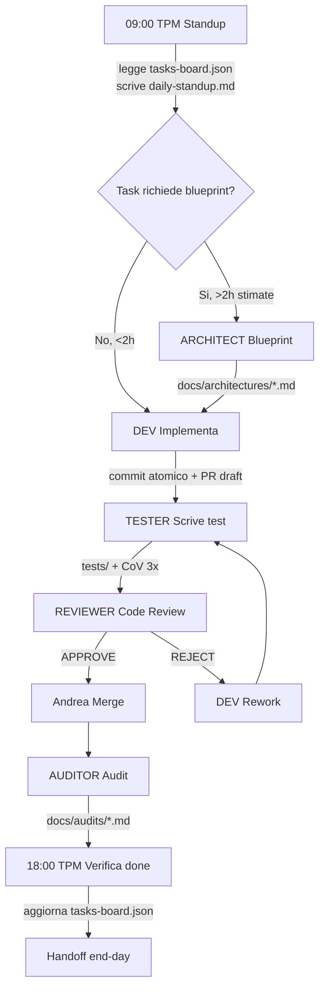
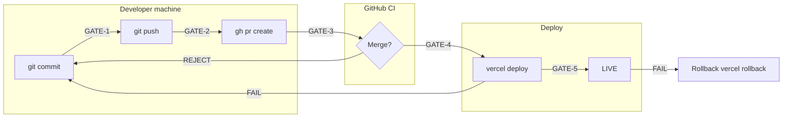

# Blueprint: CLI Autonomous Foundations

**Autore**: Architect Agent (Opus)
**Data**: 2026-04-20
**Branch**: feature/pdr-ambizioso-8-settimane
**Status**: ready_for_dev
**Scope**: Infrastruttura autonomia CLI per PDR 8 settimane (21/04 - 15/06/2026)

---

## 1. Overview paradigma 6 team peer

### Modello adottato

6 agenti Opus peer-to-peer coordinati via shared state files in `automa/team-state/`.
Nessuna gerarchia: Andrea = facilitator/integrator, non bottleneck.

Ref: `docs/pdr-ambizioso/MULTI_AGENT_ORCHESTRATION.md` (linee 29-57)

### Agenti

| Agente | File | Scrive codice | Output |
|--------|------|---------------|--------|
| TPM | `.claude/agents/team-tpm.md` | No | `automa/team-state/` planning files |
| ARCHITECT | `.claude/agents/team-architect.md` | No (solo spec) | `docs/architectures/`, `docs/decisions/` |
| DEV | `.claude/agents/team-dev.md` | Si | `src/`, `supabase/`, `scripts/`, PR |
| TESTER | `.claude/agents/team-tester.md` | Solo test | `tests/` |
| REVIEWER | `.claude/agents/team-reviewer.md` | No | PR review verdicts |
| AUDITOR | `.claude/agents/team-auditor.md` | No | `docs/audits/` |

### Coordinazione via file condivisi

```
automa/team-state/
  tasks-board.json       -- Kanban: todo / in_progress / ready_for_test / ready_for_review / done
  daily-standup.md       -- Standup giornaliero (append-only per giorno)
  decisions-log.md       -- Decisioni team cross-sessione
  blockers.md            -- Impedimenti aperti/chiusi (append-only)
  team-roster.md         -- Composizione team
```

### Regola fondamentale: nessun agente accede ai file di un altro ruolo

- TPM: mai `src/`, mai `tests/`
- ARCHITECT: mai `src/` (solo lettura per analisi), mai commit code
- DEV: mai `docs/audits/`, mai self-merge
- TESTER: mai `src/` (solo `tests/`)
- REVIEWER: mai modifica file, solo verdetti
- AUDITOR: mai modifica file, solo audit doc

Ref: `CLAUDE.md` (file critici tabella), `docs/pdr-ambizioso/MULTI_AGENT_ORCHESTRATION.md` (ruoli)

---

## 2. Daily loop architettura

### Sequenza operativa giornaliera



### Timing indicativo

| Slot | Agente | Attivita |
|------|--------|----------|
| 09:00 | TPM | Standup: legge board, assegna task giorno |
| 09:30-12:00 | ARCHITECT (se serve) | Blueprint feature >2h |
| 09:30-12:00 | DEV | Implementa task ready_for_dev |
| 12:00-14:00 | TESTER | Test post-impl + CoV 3x |
| 14:00-16:00 | REVIEWER | Code review PR aperte |
| 16:00-17:00 | AUDITOR | Audit onesto giornaliero |
| 17:00-18:00 | TPM | Verifica done, aggiorna board, handoff |

### Cross-team handoff via status transition

```
todo --> in_progress (DEV prende task)
in_progress --> ready_for_test (DEV commit + PR)
ready_for_test --> ready_for_review (TESTER CoV 3x PASS)
ready_for_review --> done (REVIEWER APPROVE + Andrea merge)
ready_for_review --> rework (REVIEWER REJECT --> torna in_progress)
done --> audited (AUDITOR verifica finale)
```

---

## 3. 5-gate hard system

Nessun gate puo essere saltato. Override solo Andrea con `[GOVERNANCE-OVERRIDE: motivo]`.

### GATE-1: Pre-commit

**Trigger**: `git commit` (pre-commit hook)
**Checks**:
1. `npx vitest run` -- PASS count >= baseline (`automa/state/baseline.json`)
2. `npm run build` -- exit 0
3. `scripts/guard-critical-files.sh` -- nessun file lockato modificato senza authorization

**Exit codes**: 0 = pass, 1 = test fail, 2 = build fail, 3 = critical file guard

**Script**: `scripts/cli-autonomous/gate-1-precommit.sh`

### GATE-2: Pre-push

**Trigger**: `git push` (pre-push hook)
**Checks**:
1. CoV 3x: `npx vitest run` eseguito 3 volte consecutive, tutti PASS
2. Test count >= baseline (no regression)
3. Nessun `--no-verify` commit nel branch

**Exit codes**: 0 = pass, 1 = CoV fail run N, 2 = regression, 3 = no-verify detected

**Script**: `scripts/cli-autonomous/gate-2-prepush.sh`

### GATE-3: Pre-merge (CI)

**Trigger**: PR opened/updated su GitHub
**Checks** (GitHub Actions workflow):
1. CI `npm run build` green
2. CI `npx vitest run` green
3. CI `scripts/guard-critical-files.sh` green
4. REVIEWER verdetto APPROVE in `tasks-board.json`
5. PZ v3 regex check su file modificati (se toccano UNLIM/chat)

**Enforced**: branch protection rule `main` -- require CI + 1 approval

**Script**: `scripts/cli-autonomous/gate-3-ci-check.sh` (local pre-check mirror)

### GATE-4: Pre-deploy

**Trigger**: pre `vercel --prod` o `vercel --target=preview`
**Checks**:
1. Bundle size delta: `npm run build` output size <= baseline + 5%
   Baseline ref: `automa/state/baseline.json` field `bundleSizeKB`
2. `npm run build` exit 0
3. No `console.log` in `src/` (grep check, allow `console.warn`/`console.error`)
4. Last CI run on branch = SUCCESS

**Exit codes**: 0 = pass, 1 = bundle regression, 2 = build fail, 3 = console.log found, 4 = CI not green

**Script**: `scripts/cli-autonomous/gate-4-predeploy.sh`

### GATE-5: Post-deploy

**Trigger**: dopo deploy vercel (prod o preview)
**Checks**:
1. `curl -s -o /dev/null -w "%{http_code}" https://www.elabtutor.school` = 200
2. `curl -s -o /dev/null -w "%{http_code}" https://www.elabtutor.school/manifest.json` = 200
3. PZ v3 live check: `curl -s https://www.elabtutor.school | grep -c "Ragazzi"` > 0 (se applicabile)
4. TTFB < 3s: `curl -w "%{time_starttransfer}" -s -o /dev/null https://www.elabtutor.school`
5. Supabase Edge Function health: `curl -s https://vxvqalmxqtezvgiboxyv.supabase.co/functions/v1/health` = 200

**Exit codes**: 0 = all pass, 1 = frontend down, 2 = manifest missing, 3 = PZ fail, 4 = TTFB slow, 5 = backend down

**Script**: `scripts/cli-autonomous/gate-5-postdeploy.sh`

### Gate flow diagram



---

## 4. Weekly DoD 13 check

Definition of Done settimanale. Scritto dal TPM ogni domenica sera in `docs/handoff/YYYY-MM-DD-week-dod.md`.

| # | Check | Come si verifica | Pass criteria |
|---|-------|------------------|---------------|
| 1 | Tutti task `done` | `tasks-board.json` zero `todo`/`in_progress` | 0 residui (carry-over documentato) |
| 2 | Git synced | `git status` clean, `git log --oneline origin/HEAD..HEAD` = 0 | 0 unpushed commits |
| 3 | CI green | ultimo workflow run su branch | SUCCESS |
| 4 | Vitest pass | `npx vitest run` 3x CoV | 3/3 PASS, count >= baseline |
| 5 | Build pass | `npm run build` | exit 0 |
| 6 | Deploy preview | `vercel --target=preview` OK | URL returns 200 |
| 7 | PZ v3 preserved | grep regex su codebase + live check | PRESENTE "Ragazzi", ASSENTE "Docente, leggi" |
| 8 | E2E smoke | 5 critical path Playwright (vedi sezione 7) | 5/5 PASS |
| 9 | Benchmark | `node scripts/benchmark.cjs --write` | score >= week N-1 score |
| 10 | Handoff doc | `docs/handoff/YYYY-MM-DD-end-weekN.md` completo | tutti campi presenti |
| 11 | Zero blocker | `automa/team-state/blockers.md` nessun OPEN P0 | 0 P0 open |
| 12 | Evidence inventory | ogni task done ha commit SHA + test link | 100% tracciabile |
| 13 | Prod deploy (weekly) | GATE-4 + GATE-5 pass | solo se weekly gate pass |

**Script verifica**: `scripts/cli-autonomous/weekly-dod-check.sh`
Output: JSON `automa/state/weekly-dod-weekN.json` con 13 boolean + summary pass/fail.

---

## 5. State recovery cross-session

### Problema

Claude CLI sessions reset context tra invocazioni. Ogni nuovo agente parte da zero.
Ref: `docs/pdr-ambizioso/HARNESS_DESIGN.md` (sezione 2, "Context Management")

### Schema claude-progress.txt

File: `automa/state/claude-progress.txt`

```
# Claude Progress -- Last Updated: <ISO timestamp>

## Current Sprint
- Sprint: sett-N-<name>
- Day: N/56
- Week: N/8
- Last commit: <SHA>
- Branch: feature/pdr-ambizioso-8-settimane

## Completed Tasks (today)
- T1-NNN: <descrizione> (commit <SHA>, PR #N)

## In-Progress Tasks
- T1-NNN: <descrizione> (assigned: <role>, status: <status>)

## Carry-Over Tomorrow
- T1-NNN: <motivo carry-over>

## Critical State
- Test count: NNNN PASS / N FAIL
- Build: PASS/FAIL
- Benchmark score: N.N/10
- Last deploy: <URL> (<SHA>) <date>
- Blockers: N open (P0: N, P1: N)

## Next Action (per agente fresco)
1. Read this file
2. Read docs/handoff/<latest>-end-day.md
3. Read automa/team-state/tasks-board.json
4. Read PDR_GIORNO_NN_*.md per task del giorno
5. Dispatch @team-tpm standup
```

### Recovery sequence (agente fresco)

1. `Read automa/state/claude-progress.txt` -- stato runtime
2. `Read automa/team-state/tasks-board.json` -- kanban corrente
3. `Read automa/team-state/daily-standup.md` -- ultimo standup
4. `Read docs/handoff/<latest>.md` -- ultimo handoff
5. Verifica git: `git log --oneline -5`, `git status`
6. Verifica test: `npx vitest run` (se dubbio su baseline)

### Handoff giornaliero

Template in `docs/pdr-ambizioso/HARNESS_DESIGN.md` (linee 107-145).
File: `docs/handoff/YYYY-MM-DD-end-day.md`

Campi obbligatori:
- Branch + last commit SHA
- Test count (vitest output reale, non da memoria)
- Build status
- Benchmark score
- Task completati con SHA
- Task non completati con motivo
- Decisioni prese
- Anomalie/warning
- Prossima sessione plan
- File modificati (per Reviewer)

### tasks-board.json sync

Schema task:
```json
{
  "id": "T1-NNN",
  "title": "...",
  "priority": "P0|P1|P2",
  "status": "todo|in_progress|ready_for_test|ready_for_review|done|rework|blocked",
  "assigned_to": "tpm|architect|dev|tester|reviewer|auditor",
  "blueprint": "docs/architectures/<feature>.md|null",
  "commit_sha": "<SHA>|null",
  "pr_number": "N|null",
  "created": "ISO date",
  "updated": "ISO date",
  "week": 1,
  "day": 1,
  "notes": "..."
}
```

Sync rule: ogni agente che tocca un task DEVE aggiornare `status` + `updated` + `assigned_to`.
TPM verifica consistenza mattina (standup) e sera (verifica done).

---

## 6. Deploy strategy

### Preview daily

Ogni giorno con almeno 1 PR merged:
```bash
scripts/cli-autonomous/deploy-preview.sh
# Internamente: GATE-4 check --> vercel --target=preview --> GATE-5 check (URL preview)
```

Output: URL preview `https://elab-builder-<sha>.vercel.app`
Salvato in: `automa/state/claude-progress.txt` campo "Last deploy"

### Prod weekly

Solo a fine settimana, dopo Weekly DoD 13 check PASS:
```bash
scripts/cli-autonomous/deploy-prod.sh
# Internamente: weekly-dod-check.sh --> GATE-4 --> vercel --prod --> GATE-5 (prod URL)
```

Rollback: `vercel rollback` se GATE-5 fail post-deploy prod.

### Frequency table

| Tipo | Frequenza | Gate richiesto | URL target |
|------|-----------|----------------|------------|
| Preview | Giornaliero (se PR merged) | GATE-4 + GATE-5 (preview) | `*.vercel.app` |
| Prod | Settimanale (domenica sera) | Weekly DoD 13 + GATE-4 + GATE-5 (prod) | `elabtutor.school` |
| Hotfix | Eccezionale (P0 bug prod) | GATE-1 + GATE-2 + GATE-5 (fast-track) | `elabtutor.school` |

---

## 7. Testing pyramid

### Layer 1: Unit vitest (base)

- **Baseline**: 12116 PASS (verificato step-0-context-analysis: 12103, standup: 12103)
- **Target sett 1**: >= 12116 (no regression)
- **Target sett 8**: 14000+
- **Run**: `npx vitest run`
- **CoV**: 3x consecutivo per ogni PR

### Layer 2: Integration (Edge Function + API)

- **Scope**: Supabase Edge Function responses, API contract verification
- **Tool**: vitest + `fetch` mock o curl scripts
- **Esempi**:
  - `curl https://vxvqalmxqtezvgiboxyv.supabase.co/functions/v1/unlim-chat` -- 200 + schema response
  - `curl .../unlim-diagnose` -- 200 + diagnosi format
  - `curl .../unlim-tts` -- 200 + audio/mpeg header
- **Target sett 1**: 5 integration test (health + chat + diagnose + hints + tts)
- **Script**: `scripts/cli-autonomous/integration-smoke.sh`

### Layer 3: E2E Playwright (20 spec target)

- **Tool**: Playwright via MCP `mcp__plugin_playwright_playwright__*`
- **Target**: 20 spec contro prod/preview
- **5 critical paths (smoke)**:
  1. Homepage carica, titolo visibile, login form presente
  2. Simulatore carica, breadboard SVG renderizzata
  3. Esperimento v1-cap6-esp1 carica, componenti presenti
  4. Chat UNLIM invia messaggio, risposta contiene "Ragazzi"
  5. Cambio esperimento funziona, URL hash aggiornato
- **15 feature spec (progressive sett 1-8)**:
  - Scratch block drag, compile, run
  - Voice button click, TTS response
  - Lavagna disegno freehand
  - Whiteboard forme + testo
  - Dashboard docente (sett 3+)
  - Volume viewer pagina corretta
  - Lesson picker raggruppamento corretto
  - Passo-passo navigazione
  - Export CSV (sett 4+)
  - PWA install prompt
  - Responsive mobile layout
  - A11y contrast ratio
  - Vision screenshot flow
  - Report fumetto render
  - Multi-experiment navigation

### Layer 4: Smoke (5 critical paths)

Subset di E2E, eseguito OGNI deploy (preview + prod).
Script: `scripts/cli-autonomous/smoke-5-paths.sh`
Usa Playwright headless: navigate + assert + screenshot.

### PZ v3 enforcement in test

Ogni E2E che tocca UNLIM chat include:
```javascript
// Assertioni Principio Zero v3
const body = await page.textContent('body');
expect(body).toMatch(/Ragazzi/i);
expect(body).not.toMatch(/Docente,?\s*leggi/i);
expect(body).not.toMatch(/Insegnante,?\s*leggi/i);
```

Ref: `docs/pdr-ambizioso/PDR_GENERALE.md` (linee 533-539)

---

## 8. Documentazione rigorosa

### Per giorno: handoff

File: `docs/handoff/YYYY-MM-DD-end-day.md`
Scritto da TPM o Andrea fine giornata.
Campi: vedi sezione 5 sopra.

### Per deploy: evidence

File: `docs/evidence/deploy-YYYY-MM-DD-<type>.md`
Contiene:
- Commit SHA deployato
- GATE-4 output (bundle size, console.log check)
- GATE-5 output (curl results, TTFB, PZ check)
- Screenshot Playwright della homepage post-deploy
- URL preview/prod

### Per decisione: ADR

File: `docs/decisions/ADR-NNN-<topic>.md`
Standard format: Context, Decision, Status, Consequences.
Trigger: scelta architetturale con impatto >3 file o >1 settimana.

### Per settimana: CHANGELOG

File: `CHANGELOG.md` (root)
Append entry per settimana:
```
## [Sett N] - YYYY-MM-DD

### Added
- ...
### Fixed
- ...
### Changed
- ...
```

### Per audit: report onesto

File: `docs/audits/YYYY-MM-DD-<topic>-onesto.md`
Scritto da AUDITOR.
Format: Self-claim vs Reality table + verdetto + action items.
Ref: `docs/pdr-ambizioso/HARNESS_DESIGN.md` (linee 303-320)

---

## 9. MCP usage map

| MCP | Agente primario | Use case | Esempio invocazione |
|-----|-----------------|----------|---------------------|
| `mcp__plugin_playwright_playwright__*` | TESTER, AUDITOR | E2E test, live verify, screenshot | `browser_navigate(url)`, `browser_click(selector)`, `browser_screenshot()` |
| `mcp__supabase__*` | DEV | Edge Function deploy, SQL query, secrets | `deploy_edge_function(name)`, `execute_sql(query)`, `list_secrets()` |
| `mcp__plugin_claude-mem_mcp-search__*` | TPM, ARCHITECT | Persistence cross-session, ricerca decisioni passate | `search({query: "decisione RAG"})`, `save({content: "..."})` |
| `mcp__context7__*` | ARCHITECT, DEV | Docs aggiornate framework (React 19, Vite 7, vitest) | `query-docs({library: "react", query: "useEffect cleanup"})` |
| `mcp__plugin_serena_serena__*` | ARCHITECT | Semantic codebase search, find symbol, pattern | `find_symbol("CircuitSolver")`, `search_for_pattern("useState.*experiment")` |
| `mcp__sentry__*` | AUDITOR | Error monitoring production | `get_issues({project: "elab-builder"})` |
| `mcp__vercel__*` | DEV | Deploy management, rollback | `deploy({target: "preview"})` |
| `mcp__cloudflare__*` | DEV (sett 6+) | KV store, Workers | `kv_put(key, value)` |

### Regole MCP

- Playwright: usato SOLO da TESTER e AUDITOR (non DEV -- evita bias "funziona da me")
- Supabase: usato SOLO da DEV per deploy/query (TESTER verifica via curl, non via MCP diretto)
- claude-mem: usato da TPM per persistenza decisioni, da ARCHITECT per recall pattern precedenti
- context7: preferito a WebFetch per docs framework (piu affidabile, no auth issues)

---

## 10. Script inventory

Tutti in `scripts/cli-autonomous/`. Da creare come nuova directory.

### 10.1 gate-1-precommit.sh

**Purpose**: Pre-commit hook gate. Vitest + build + critical file guard.
**Input**: nessuno (opera su staged files)
**Output**: stdout log con PASS/FAIL per check
**Exit codes**: 0=pass, 1=test fail, 2=build fail, 3=critical file violation
**Dipendenze**: `npx vitest run`, `npm run build`, `scripts/guard-critical-files.sh`

### 10.2 gate-2-prepush.sh

**Purpose**: Pre-push hook gate. CoV 3x vitest + baseline check.
**Input**: nessuno
**Output**: stdout log con 3 run vitest + pass count comparison
**Exit codes**: 0=pass, 1=CoV fail (run N), 2=regression (count < baseline), 3=no-verify detected
**Dipendenze**: `npx vitest run`, `automa/state/baseline.json`

### 10.3 gate-3-ci-check.sh

**Purpose**: Local mirror di CI check (per pre-PR validation).
**Input**: nessuno
**Output**: stdout simulated CI result
**Exit codes**: 0=pass, 1=build fail, 2=test fail, 3=guard fail
**Dipendenze**: `npm run build`, `npx vitest run`, `scripts/guard-critical-files.sh`

### 10.4 gate-4-predeploy.sh

**Purpose**: Pre-deploy validation. Bundle size + console.log check + CI status.
**Input**: `$1` = target ("preview" | "prod")
**Output**: stdout log + `automa/state/predeploy-check.json`
**Exit codes**: 0=pass, 1=bundle regression, 2=build fail, 3=console.log found, 4=CI not green
**Dipendenze**: `npm run build`, `gh run list`, `automa/state/baseline.json`

### 10.5 gate-5-postdeploy.sh

**Purpose**: Post-deploy verification. Health check + PZ + TTFB.
**Input**: `$1` = URL da verificare
**Output**: stdout log + `automa/state/postdeploy-check.json`
**Exit codes**: 0=all pass, 1=frontend down, 2=manifest missing, 3=PZ fail, 4=TTFB slow, 5=backend down
**Dipendenze**: `curl`

### 10.6 weekly-dod-check.sh

**Purpose**: Weekly Definition of Done 13 check.
**Input**: `$1` = week number (1-8)
**Output**: `automa/state/weekly-dod-weekN.json` (13 boolean + summary)
**Exit codes**: 0=all 13 pass, 1=partial (N/13 pass)
**Dipendenze**: tutti i gate scripts + `git status` + `tasks-board.json` parser

### 10.7 deploy-preview.sh

**Purpose**: Deploy preview con gate enforcement.
**Input**: nessuno (usa branch corrente)
**Output**: URL preview stampata + salvata in `claude-progress.txt`
**Exit codes**: 0=deployed OK, 1=GATE-4 fail, 2=vercel fail, 3=GATE-5 fail
**Dipendenze**: `gate-4-predeploy.sh`, `vercel`, `gate-5-postdeploy.sh`

### 10.8 integration-smoke.sh

**Purpose**: Integration test Supabase Edge Functions via curl.
**Input**: nessuno (usa URL prod/preview)
**Output**: stdout log con endpoint + status code + response time
**Exit codes**: 0=all pass, 1=N endpoint(s) fail
**Dipendenze**: `curl`, endpoint URLs hardcoded

---

## Edge cases (5)

### EC-1: Vitest flaky test

**Scenario**: CoV 3x ha 2 PASS e 1 FAIL (test flaky, non regression reale).
**Mitigation**: Se 2/3 PASS con stessa suite, log il test flaky in `automa/state/flaky-tests.log`. Non bloccare merge ma obbligare TESTER a investigare entro 24h. Se test flaky persiste 3 giorni, marcarlo `skip` con TODO e aprire task P1.

### EC-2: Bundle size spike da dependency update

**Scenario**: Vite aggiorna chunk splitting, bundle size cresce >5% senza codice aggiunto.
**Mitigation**: GATE-4 segnala warning (non hard block) se delta 5-15%. Hard block solo se delta >15%. ARCHITECT review se >5% per valutare chunk config in `vite.config.js` (file critico, coordinamento Andrea).

### EC-3: Supabase PAUSED durante deploy

**Scenario**: Supabase free tier va in PAUSED, GATE-5 fallisce su backend check.
**Mitigation**: GATE-5 backend check = soft fail (warning, non block) se Supabase 401/503. Andrea resume manuale Supabase dashboard. Deploy frontend procede indipendentemente. Ref: `CLAUDE.md` bug #5 "Dashboard pochi dati reali -- Supabase probabilmente PAUSED".

### EC-4: Context window esaurito a meta task

**Scenario**: Agente DEV sta implementando feature complessa, context >100K token, inizia a troncare.
**Mitigation**: Pattern reset da `HARNESS_DESIGN.md` (linee 178-198). Agente scrive handoff intermedio in `automa/state/claude-progress.txt` + `docs/handoff/YYYY-MM-DD-mid-day.md`. Nuova sessione legge handoff. Cap: reset proattivo dopo 4h o 100K token.

### EC-5: Working tree dirty 144 file conflict

**Scenario**: I 144 file M carry-over (CSS + engine unstaged) conflittano con nuovi commit.
**Mitigation**: Ref `automa/state/step-0-context-analysis.md` -- "144 M carry-over pre-esistente, NON toccare". DEV lavora solo su file in scope task. Se conflict su file M, `git stash` temporaneo del file specifico, merge, `git stash pop`. Mai `git add -A` (regola CLAUDE.md).

---

## Rischi tecnici (10)

| # | Rischio | Prob | Impatto | Mitigation |
|---|---------|------|---------|------------|
| R1 | Gate scripts non testati inizialmente | 70% | Medio | Scrivere test vitest per ogni gate script. Prima settimana: run manuale + fix. |
| R2 | tasks-board.json corrupted da write concorrente | 40% | Alto | Solo 1 agente scrive alla volta (Andrea dispatch seriale). JSON schema validation nel TPM. |
| R3 | Handoff doc incompleto -> agente fresco perde contesto | 50% | Alto | Template obbligatorio con campi required. TPM verifica completezza sera. |
| R4 | Baseline vitest count impreciso (12056 vs 12103 vs 12116 discrepanza) | Certo | Medio | Primo task sett 1: `npx vitest run` reale, scrivere count in `automa/state/baseline.json`. Unica fonte verita. |
| R5 | GATE-2 CoV 3x troppo lento (3x vitest = 30+ min) | 60% | Medio | Usare `vitest run --reporter=json` per speed. Se >15min, ridurre a CoV 2x per push non-main. 3x solo pre-merge. |
| R6 | AUDITOR troppo scettico -> rallenta pipeline | 30% | Basso | AUDITOR audit solo 1x/giorno (non per ogni PR). Task <1h esentati da audit formale. |
| R7 | Vercel deploy fail per timeout/quota | 20% | Medio | Retry 1x automatico in `deploy-preview.sh`. Se 2x fail, log blocker + Andrea interviene. |
| R8 | MCP Playwright non disponibile / broken | 30% | Alto | Fallback: curl-based smoke test (scripts/cli-autonomous/smoke-5-paths.sh senza Playwright). E2E degradato ma non bloccante. |
| R9 | 6 agenti Opus = alto consumo token Max subscription | 50% | Medio | Cap: max 5 dispatch/giorno sett 1. Scale a 10-15 dispatch/giorno sett 4+. Monitor quota in handoff. |
| R10 | File critici engine modificati per errore da DEV | 20% | Critico | `scripts/guard-critical-files.sh` gia esiste (ref CLAUDE.md). GATE-1 lo invoca. Se bypass -> REVIEWER blocca PR. |

---

## File impact list (tutti nuovi file)

### Scripts (da creare)

```
scripts/cli-autonomous/
  gate-1-precommit.sh
  gate-2-prepush.sh
  gate-3-ci-check.sh
  gate-4-predeploy.sh
  gate-5-postdeploy.sh
  weekly-dod-check.sh
  deploy-preview.sh
  integration-smoke.sh
```

### State files (da creare)

```
automa/state/claude-progress.txt          -- state recovery cross-session
automa/state/predeploy-check.json         -- output GATE-4
automa/state/postdeploy-check.json        -- output GATE-5
automa/state/weekly-dod-weekN.json        -- output weekly DoD (N=1..8)
automa/state/flaky-tests.log              -- log test flaky da CoV
```

### Doc templates (da creare)

```
docs/handoff/TEMPLATE-end-day.md          -- template handoff giornaliero
docs/evidence/TEMPLATE-deploy.md          -- template evidence deploy
docs/decisions/ADR-001-cli-autonomous-paradigm.md  -- prima ADR
```

### File esistenti da modificare

```
.husky/pre-commit                         -- aggiungere invocazione gate-1-precommit.sh
.husky/pre-push                           -- aggiungere invocazione gate-2-prepush.sh
automa/state/baseline.json                -- aggiungere campo bundleSizeKB
```

### File NON toccati (lockati)

```
src/components/simulator/engine/*         -- LOCKED (CLAUDE.md)
src/services/api.js                       -- critico, no modifiche
src/services/simulator-api.js             -- critico, no modifiche
vite.config.js                            -- critico, no modifiche
package.json                              -- no dipendenze aggiunte senza OK Andrea
```

---

## Riferimenti

- `CLAUDE.md` -- regole ferree, file critici, anti-regressione
- `docs/pdr-ambizioso/PDR_GENERALE.md` -- goal 8 settimane, stack, governance 8-step
- `docs/pdr-ambizioso/PDR_SETT_1_STABILIZE.md` -- obiettivi sett 1, team composition
- `docs/pdr-ambizioso/MULTI_AGENT_ORCHESTRATION.md` -- 6 agenti peer, coordinazione
- `docs/pdr-ambizioso/HARNESS_DESIGN.md` -- 3 pattern Anthropic, context management, grading
- `automa/state/step-0-context-analysis.md` -- stato git, worktree, conflict risks
- `automa/team-state/daily-standup.md` -- standup Day 01
- `scripts/guard-critical-files.sh` -- guard file critici esistente
- `scripts/benchmark.cjs` -- benchmark 10 metriche pesate
