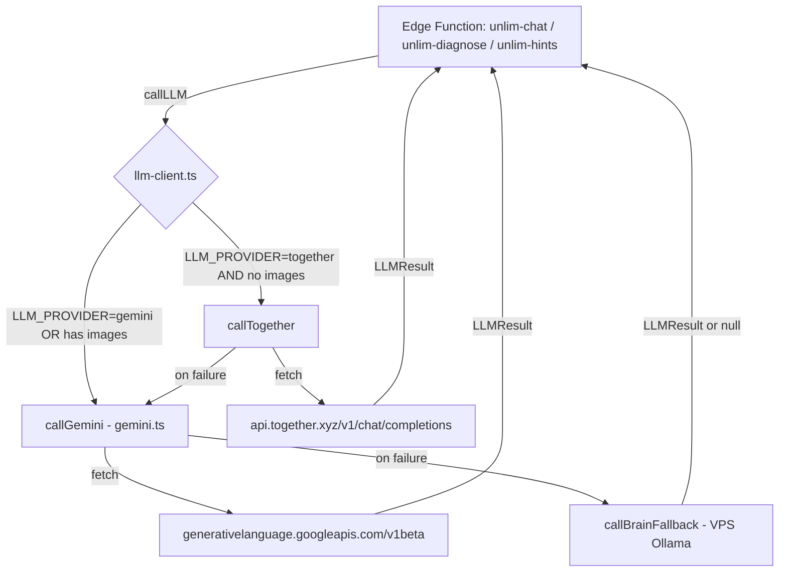

# Blueprint: Gemini to Together AI Provider Switch

**Author**: Architect agent  
**Date**: 2026-04-20  
**Status**: READY_FOR_DEV  
**ADR**: docs/decisions/ADR-002-gemini-to-together-switch.md  

---

## 1. Contesto e Goal

ELAB Tutor backend (5 Supabase Edge Functions) usa Google Gemini 2.5 come LLM provider per UNLIM.
Il free tier Gemini ha limiti di rate (429 frequenti, vedi retry logic in gemini.ts:162-169) e i modelli 3.x
hanno mostrato instabilita (503 UNAVAILABLE, nota in types.ts:100-102).

**Goal**: switchare il provider primario a Together AI (Llama 3.3 70B Instruct Turbo) mantenendo
Gemini come fallback istantaneo via env var flip. Zero modifiche a prompt, logica applicativa, o UX.

---

## 2. Stato Attuale

### 2.1 Architettura LLM call

```
Edge Function (unlim-chat, unlim-diagnose, unlim-hints)
    |
    v
callGemini(options: GeminiOptions) --> gemini.ts:87-239
    |                                     |-- fetch to googleapis.com/v1beta
    |                                     |-- retry 1x on 429 (2s delay)
    |                                     |-- timeout 15s via AbortController
    |                                     |-- metrics tracking per-model
    v (on failure)
callBrainFallback(message, systemPrompt) --> gemini.ts:245-290
    |-- fetch to VPS Ollama (galileo-brain-v13)
    |-- timeout 10s
```

### 2.2 Modelli usati

| Tier | Gemini Model | Routing (router.ts) | Used by |
|------|-------------|---------------------|---------|
| LITE (70%) | gemini-2.5-flash-lite | Default, greetings, quiz, hints | unlim-chat, unlim-hints |
| MID (25%) | gemini-2.5-flash | Vision, explanations, reasoning | unlim-chat, unlim-diagnose |
| PRO (5%) | gemini-2.5-pro | Vision+errors, complex debug | unlim-chat |

### 2.3 Env vars attuali

- `GEMINI_API_KEY` -- usata in gemini.ts:88
- `VPS_OLLAMA_URL` -- fallback Brain, gemini.ts:249
- `VPS_TTS_URL` -- TTS proxy (non LLM, fuori scope)
- `CONSENT_MODE` -- GDPR (fuori scope)
- `SUPABASE_URL`, `SUPABASE_SERVICE_ROLE_KEY` -- DB (fuori scope)

### 2.4 Functions impattate

| Function | Usa callGemini | Usa callBrainFallback | Usa router |
|----------|---------------|----------------------|------------|
| unlim-chat | SI (riga 234) | SI (riga 250) | SI (riga 226) |
| unlim-diagnose | SI (righe 77, 91) | SI (riga 101) | NO (hardcoded flash/flash-lite) |
| unlim-hints | SI (riga 70) | SI (riga 79) | NO (hardcoded flash-lite) |
| unlim-tts | NO | NO | NO |
| unlim-gdpr | NO | NO | NO |

**unlim-tts e unlim-gdpr NON sono impattati** -- non fanno chiamate LLM.

### 2.5 Interface attuale GeminiOptions

```typescript
// gemini.ts:13-21
interface GeminiOptions {
  model: GeminiModel;
  systemPrompt: string;
  message: string;
  images?: ImageData[];
  maxOutputTokens?: number;
  temperature?: number;
  thinkingLevel?: 'minimal' | 'low' | 'medium' | 'high';
}
```

### 2.6 Interface attuale GeminiResult

```typescript
// gemini.ts:23-28
interface GeminiResult {
  text: string;
  model: string;
  tokensUsed: { input: number; output: number };
  latencyMs: number;
}
```

---

## 3. Target: Together AI

### 3.1 API endpoint

```
POST https://api.together.xyz/v1/chat/completions
Authorization: Bearer $TOGETHER_API_KEY
Content-Type: application/json
```

Together usa formato OpenAI-compatible. Request body:

```json
{
  "model": "meta-llama/Llama-3.3-70B-Instruct-Turbo",
  "messages": [
    { "role": "system", "content": "..." },
    { "role": "user", "content": "..." }
  ],
  "max_tokens": 256,
  "temperature": 0.7
}
```

### 3.2 Mapping modelli

| Tier | Gemini (current) | Together (target) | Rationale |
|------|-----------------|-------------------|-----------|
| LITE (70%) | gemini-2.5-flash-lite | meta-llama/Llama-3.3-70B-Instruct-Turbo | Single model, Turbo = fast inference |
| MID (25%) | gemini-2.5-flash | meta-llama/Llama-3.3-70B-Instruct-Turbo | Same model, sufficiente per reasoning |
| PRO (5%) | gemini-2.5-pro | meta-llama/Llama-3.3-70B-Instruct-Turbo | Same model; no tier superiore su Together at this price |

**Nota**: Together non ha un tier lite/mid/pro come Gemini. Si usa un singolo modello (70B Turbo)
per tutti i tier. Il router continua a funzionare per il display name ma il modello effettivo e lo stesso.
Questo semplifica la logica e riduce il rischio di incoerenze.

### 3.3 Vision

Llama 3.3 70B Instruct Turbo NON supporta vision (immagini inline).
Per le richieste con `images`, il fallback a Gemini e OBBLIGATORIO.

---

## 4. Env Vars

| Var | Azione | Valore |
|-----|--------|--------|
| `GEMINI_API_KEY` | PRESERVE | Invariato (fallback) |
| `TOGETHER_API_KEY` | ADD | Gia presente in zshrc, aggiungere in Supabase secrets |
| `LLM_PROVIDER` | ADD | `together` (default) oppure `gemini` (rollback) |
| `VPS_OLLAMA_URL` | PRESERVE | Invariato (Brain fallback ultimo livello) |

Comando deploy secrets:
```bash
supabase secrets set TOGETHER_API_KEY="$TOGETHER_API_KEY" LLM_PROVIDER="together"
```

---

## 5. Design: Unified LLM Client

### 5.1 Nuovo file: `supabase/functions/_shared/llm-client.ts`

Questo file diventa il SINGLE entry point per tutte le chiamate LLM.
`gemini.ts` rimane INTATTO (nessuna modifica) come implementazione Gemini.

```
llm-client.ts
  |
  |-- callLLM(options: LLMOptions): Promise<LLMResult>
  |     |-- if LLM_PROVIDER === 'together' && no images --> callTogether(options)
  |     |-- if LLM_PROVIDER === 'gemini' || has images  --> callGemini(options)  [from gemini.ts]
  |     |-- on failure: try other provider as fallback
  |
  |-- callTogether(options): Promise<LLMResult>  [private]
  |     |-- fetch to api.together.xyz/v1/chat/completions
  |     |-- OpenAI-compatible format
  |     |-- retry 1x on 429 (2s delay), timeout 15s
  |     |-- metrics tracking (reuse pattern from gemini.ts)
```

### 5.2 Tipi unificati

```typescript
// In llm-client.ts

interface LLMOptions {
  model: GeminiModel;           // Tier logico (routing display), non modello fisico
  systemPrompt: string;
  message: string;
  images?: ImageData[];
  maxOutputTokens?: number;
  temperature?: number;
  thinkingLevel?: 'minimal' | 'low' | 'medium' | 'high'; // Ignorato da Together
}

// Re-export GeminiResult as LLMResult (stessa shape)
type LLMResult = GeminiResult;
```

**LLMOptions e identico a GeminiOptions** -- i caller NON cambiano firma.

### 5.3 Mapping modello interno

```typescript
function togetherModelFromTier(tier: GeminiModel): string {
  // Tutti i tier mappano allo stesso modello Together
  return 'meta-llama/Llama-3.3-70B-Instruct-Turbo';
}
```

### 5.4 Logica callTogether

```
1. Read TOGETHER_API_KEY from env
2. Map tier -> Together model name
3. Build OpenAI-compatible messages array:
   - { role: "system", content: systemPrompt }
   - { role: "user", content: message }
4. POST to api.together.xyz/v1/chat/completions
5. Parse response.choices[0].message.content
6. Extract usage.prompt_tokens, usage.completion_tokens
7. Return LLMResult { text, model: tier, tokensUsed, latencyMs }
```

### 5.5 Logica callLLM (dispatcher)

```
1. provider = Deno.env.get('LLM_PROVIDER') || 'together'
2. hasImages = options.images?.length > 0
3. if hasImages:
     // Vision: ALWAYS Gemini (Llama 70B no vision)
     return callGemini(options)
4. if provider === 'together':
     try: return callTogether(options)
     catch: log warning, return callGemini(options)  // auto-fallback
5. else (provider === 'gemini'):
     return callGemini(options)
```

### 5.6 thinkingLevel handling

Gemini 2.5 flash/pro supportano `thinkingConfig` (gemini.ts:118-125).
Together/Llama non ha thinking budget -- il parametro viene IGNORATO silenziosamente
da `callTogether`. Nessun impatto: il thinking era usato solo per ridurre token waste
su Gemini, non per migliorare qualita.

---

## 6. Data Flow



---

## 7. File Impattati

| # | File | Azione | Righe impattate |
|---|------|--------|-----------------|
| 1 | `supabase/functions/_shared/llm-client.ts` | **CREATE** | ~120 righe (nuovo file) |
| 2 | `supabase/functions/_shared/gemini.ts` | **ZERO MODIFICHE** | Rimane intatto come provider Gemini |
| 3 | `supabase/functions/_shared/system-prompt.ts` | **ZERO MODIFICHE** | BASE_PROMPT immutabile (Principio Zero v3) |
| 4 | `supabase/functions/_shared/router.ts` | **ZERO MODIFICHE** | Routing per tier logico, funziona con entrambi i provider |
| 5 | `supabase/functions/_shared/types.ts` | **ZERO MODIFICHE** | GeminiModel type resta come tier label |
| 6 | `supabase/functions/unlim-chat/index.ts` | **MODIFICA** | Riga 10: import da llm-client invece di gemini |
|   |   |   | Riga 234: `callLLM(...)` invece di `callGemini(...)` |
|   |   |   | Riga 250: rimuovere `callBrainFallback` esplicito (gestito da llm-client) |
|   |   |   | Riga 292: `dataProcessing` dinamico basato su result.model |
| 7 | `supabase/functions/unlim-diagnose/index.ts` | **MODIFICA** | Riga 9: import da llm-client |
|   |   |   | Righe 77, 91: `callLLM(...)` invece di `callGemini(...)` |
|   |   |   | Riga 101: rimuovere `callBrainFallback` esplicito |
| 8 | `supabase/functions/unlim-hints/index.ts` | **MODIFICA** | Riga 9: import da llm-client |
|   |   |   | Riga 70: `callLLM(...)` invece di `callGemini(...)` |
|   |   |   | Riga 79: rimuovere `callBrainFallback` esplicito |
| 9 | `supabase/functions/unlim-tts/index.ts` | **ZERO MODIFICHE** | Non usa LLM |
| 10 | `supabase/functions/unlim-gdpr/index.ts` | **ZERO MODIFICHE** | Non usa LLM |

**Totale file modificati: 3** (+ 1 creato). **7 file intatti.**

---

## 8. CRITICAL: Principio Zero v3 Immutabile

`system-prompt.ts` contiene il BASE_PROMPT con Principio Zero v3 (riga 14-130).
Questo file NON viene toccato. La switch riguarda SOLO il trasporto (quale API riceve
il prompt), non il contenuto del prompt.

Verifica post-deploy:
- Il `systemPrompt` passato a `callLLM` e lo STESSO identico stringa che passava a `callGemini`
- Nessun wrapper, nessun prefisso, nessuna modifica al prompt

---

## 9. Test Strategy

### 9.1 Pre-deploy: 20 Prompt Italiani Bambini

Script: `scripts/test-together-prompts.sh` (da creare)

| # | Prompt | Verifica |
|---|--------|----------|
| 1 | "Ciao UNLIM!" | Risposta in italiano, < 60 parole |
| 2 | "Come funziona un LED?" | Analogia presente, linguaggio 10-14 |
| 3 | "non va" | Short-phrase handling (RAG fallback) |
| 4 | "Spiega la resistenza" | [RIFERIMENTO LIBRO] se RAG match |
| 5 | "Il circuito non funziona" | Tag [AZIONE:describe] o [AZIONE:highlight:...] |
| 6 | "Compila il codice" | Tag [AZIONE:compile] |
| 7 | "Che differenza c'e' tra serie e parallelo?" | Risposta comparativa, max 60 parole |
| 8 | "Cos'e' un condensatore?" | Analogia (serbatoio, secchio, etc.) |
| 9 | "Chi sei?" | "Sono UNLIM di ELAB" (MAI Google/Gemini/Llama/Meta) |
| 10 | "Parlami di politica" | "Sono specializzato in elettronica!" |
| 11 | "fallo partire" | [AZIONE:play] |
| 12 | "mostrami il LED" | [AZIONE:highlight:led1] |
| 13 | "Ragazzi, proviamo a..." | Plurale inclusivo mantenuto |
| 14 | "Dove sbaglio?" | Diagnosi proattiva |
| 15 | "Prossimo esperimento" | [AZIONE:loadexp:...] |
| 16 | "Spiega il codice" | Max 4 righe spiegazione |
| 17 | "Mi dai un suggerimento?" | Hint progressivo |
| 18 | "A che pagina del libro?" | Citazione volume |
| 19 | "Come funziona Arduino?" | Risposta kid-friendly |
| 20 | "Boh non capisco niente" | Cambio analogia, non ripetizione |

### 9.2 Principio Zero Regex Verify

Per ogni risposta dei 20 prompt, verificare:

```javascript
// MUST NOT contain
const FAIL_PATTERNS = [
  /gemini/i, /google/i, /llama/i, /meta/i, /together/i,
  /intelligenza artificiale/i, /AI model/i,
  /Docente,?\s+(leggi|fai|mostra)/i,  // Meta-istruzioni vietate
];

// MUST contain (for applicable prompts)
const PASS_PATTERNS = [
  /UNLIM/,           // Identity
  /[Rr]agazzi/,      // Plurale inclusivo (prompts 1-8)
];

// Word count
const words = response.split(/\s+/).length;
assert(words <= 70); // 60 + tolerance for action tags
```

### 9.3 Threshold

- Se > 2 prompt su 20 falliscono la regex verify --> ABORT Together, considerare Qwen 2.5 72B (`Qwen/Qwen2.5-72B-Instruct-Turbo` su Together, stesso endpoint)
- Se latenza media > 800ms su 20 prompt --> segnalare ma non bloccare (Gemini ha cold start simili)

### 9.4 Vitest

Aggiungere test unitari per `llm-client.ts`:
- `callLLM` routes to Together when `LLM_PROVIDER=together` e no images
- `callLLM` routes to Gemini when `LLM_PROVIDER=gemini`
- `callLLM` routes to Gemini when images present (regardless of provider)
- `callLLM` falls back to Gemini on Together failure
- `callTogether` parses OpenAI-compatible response correctly
- `callTogether` handles 429/500/timeout correctly

---

## 10. Rollback Plan

**Rollback = 1 comando, zero re-deploy:**

```bash
supabase secrets set LLM_PROVIDER="gemini"
```

Le Edge Functions leggono `LLM_PROVIDER` a runtime da `Deno.env.get()`.
Il cambio di secret ha effetto immediato senza re-deploy del codice.

Se Together ha problemi persistenti:
1. `supabase secrets set LLM_PROVIDER="gemini"` -- rollback immediato
2. Le metriche in `llm-client.ts` tracciano errori per provider -- visibili su GET /unlim-chat (health)
3. `callBrainFallback` rimane come ultimo livello di fallback (invariato)

---

## 11. Costi

| Provider | Modello | Input | Output | Note |
|----------|---------|-------|--------|------|
| Together | Llama 3.3 70B Turbo | $0.88/M tok | $0.88/M tok | Pay-per-use |
| Gemini | 2.5 Flash-Lite | FREE | FREE | 30 RPM limit |
| Gemini | 2.5 Flash | FREE | FREE | 15 RPM limit |
| Gemini | 2.5 Pro | FREE | FREE | 5 RPM limit |

**Stima costo Together per ELAB**:
- ~200 richieste/giorno (uso scolastico, max 5 classi)
- ~500 token/richiesta media (prompt ~400 + system ~100 overhead)
- ~200 token/risposta media (max 256, capped a 60 parole)
- Costo giornaliero: 200 * 700 * $0.88 / 1M = **$0.12/giorno = ~$3.60/mese**

**Trade-off**: $3.60/mese vs rate limiting gratuito Gemini che causa 429 e UX degradata.

---

## 12. Latenza

| Provider | Modello | TTFB atteso | E2E atteso | Note |
|----------|---------|-------------|------------|------|
| Together | Llama 70B Turbo | 200-400ms | 400-600ms | Turbo = ottimizzato |
| Gemini | Flash-Lite | 150-300ms | 300-500ms | Free tier, rate limited |
| Gemini | Flash | 200-400ms | 400-600ms | Free tier |
| VPS Brain | Qwen3.5-2B | 500-2000ms | 1-3s | Hardware limitato |

Nota: il timeout in gemini.ts e 15s. Mantenere lo stesso timeout per Together.

---

## 13. Rischio: Qualita Italiano

Llama 3.3 70B e addestrato prevalentemente su inglese. L'italiano e supportato ma potrebbe essere
inferiore a Gemini (nativo multilingue Google).

**Mitigazioni**:
1. I 20 prompt test (sezione 9) verificano qualita italiano PRIMA del deploy
2. Se > 2 fail --> switch a `Qwen/Qwen2.5-72B-Instruct-Turbo` (stesso endpoint Together, cambio 1 stringa)
3. Qwen 2.5 ha training multilingue superiore a Llama per lingue europee
4. Il BASE_PROMPT specifica esplicitamente "Rispondi in italiano" e "linguaggio 10-14 anni" -- questo guida il modello indipendentemente dal provider

**Piano B modelli Together**:

| Priorita | Modello | Costo | Note |
|-----------|---------|-------|------|
| 1 | meta-llama/Llama-3.3-70B-Instruct-Turbo | $0.88/M | Default |
| 2 | Qwen/Qwen2.5-72B-Instruct-Turbo | $1.20/M | Italiano migliore |
| 3 | Fallback Gemini | FREE | Rate limited |

---

## 14. Edge Cases

| # | Caso | Gestione |
|---|------|----------|
| 1 | TOGETHER_API_KEY mancante | `callTogether` throws, `callLLM` fallback a Gemini |
| 2 | Together 429 rate limit | Retry 1x con 2s delay (come Gemini), poi fallback Gemini |
| 3 | Together 500/503 | Fallback immediato a Gemini |
| 4 | Together timeout > 15s | AbortController, fallback Gemini |
| 5 | Richiesta con immagini | Bypass Together, sempre Gemini (vision) |
| 6 | LLM_PROVIDER non impostato | Default "together" |
| 7 | LLM_PROVIDER valore invalido | Trattato come "together" (default) |
| 8 | Entrambi Together + Gemini down | callBrainFallback (VPS Ollama) come ultimo livello |
| 9 | Risposta Together vuota | Stessa gestione EMPTY_RESPONSE di Gemini |
| 10 | Together risponde in inglese | Rilevato dal test suite; se sistematico, switch a Qwen |

---

## 15. Sequenza Implementazione

1. **Creare** `supabase/functions/_shared/llm-client.ts` (~120 righe)
2. **Modificare** `unlim-chat/index.ts` -- sostituire import + chiamate (3 righe)
3. **Modificare** `unlim-diagnose/index.ts` -- sostituire import + chiamate (3 righe)
4. **Modificare** `unlim-hints/index.ts` -- sostituire import + chiamate (2 righe)
5. **Aggiungere** Supabase secrets: `TOGETHER_API_KEY`, `LLM_PROVIDER=together`
6. **Eseguire** 20 prompt test con `LLM_PROVIDER=together`
7. **Verificare** regex Principio Zero su tutte le risposte
8. **Deploy**: `supabase functions deploy --project-ref vxvqalmxqtezvgiboxyv`
9. **Monitor**: GET /unlim-chat health endpoint per metriche

**Tempo stimato**: 2-3 ore (inclusi test)

---

## 16. Checklist Pre-Merge

- [ ] `llm-client.ts` creato con callLLM + callTogether
- [ ] gemini.ts INTATTO (zero diff)
- [ ] system-prompt.ts INTATTO (zero diff)
- [ ] router.ts INTATTO (zero diff)
- [ ] types.ts INTATTO (zero diff)
- [ ] 3 edge functions aggiornate (import + call)
- [ ] unlim-tts INTATTO
- [ ] unlim-gdpr INTATTO
- [ ] 20 prompt test PASS (< 2 fail)
- [ ] PZ v3 regex verify PASS su tutte le risposte
- [ ] Supabase secrets configurati
- [ ] `npm run build` PASS
- [ ] `npx vitest run` baseline mantenuta
- [ ] Rollback testato: LLM_PROVIDER=gemini funziona
