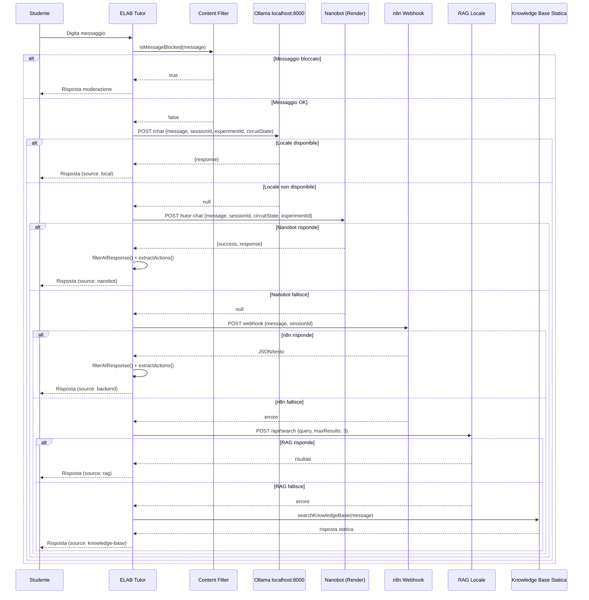
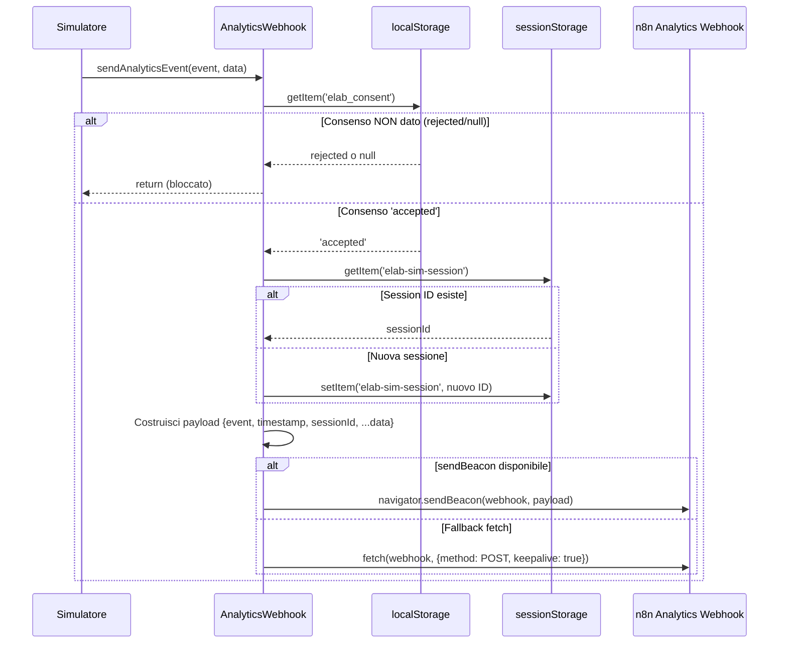
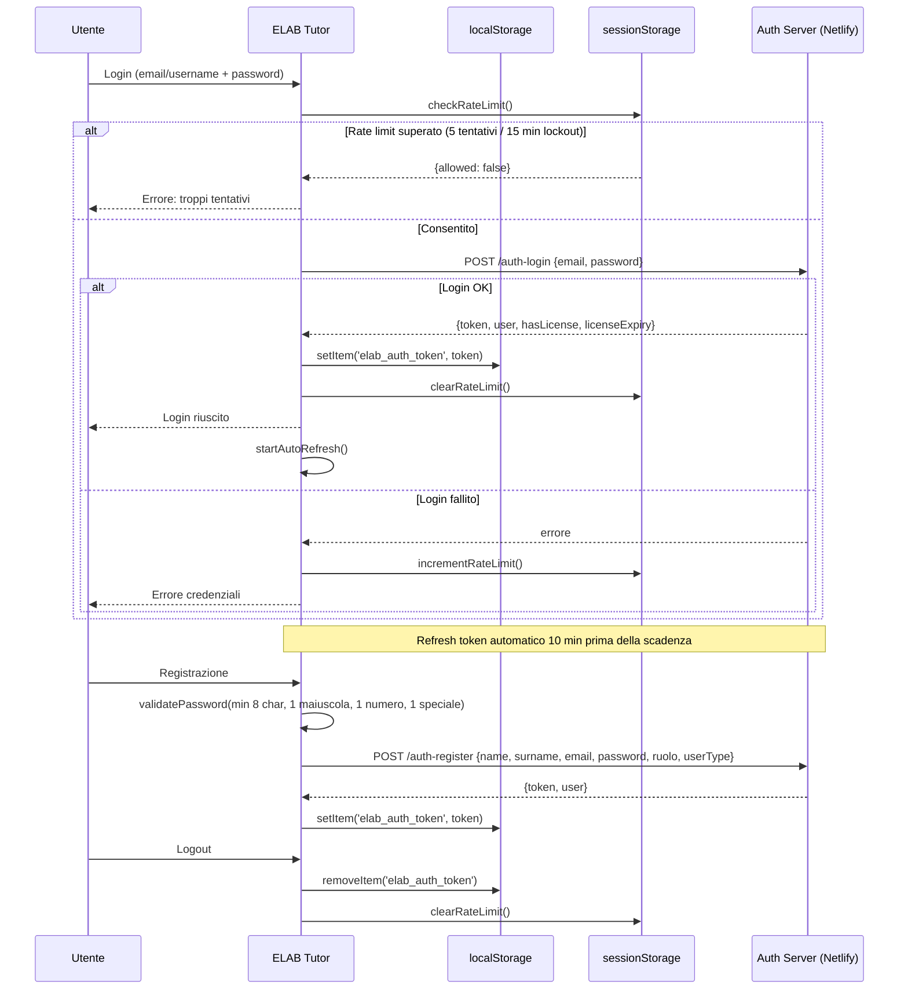
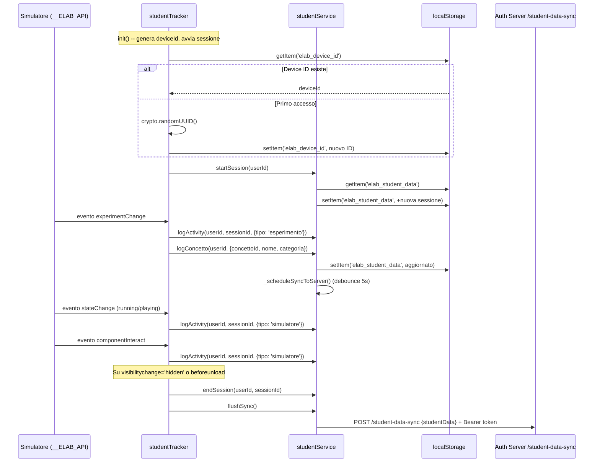
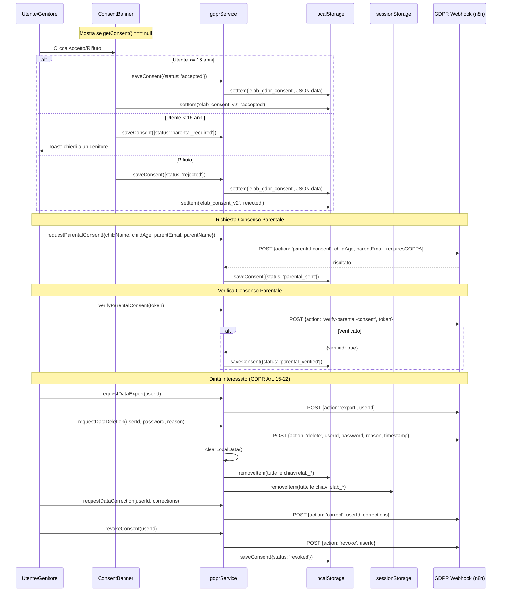
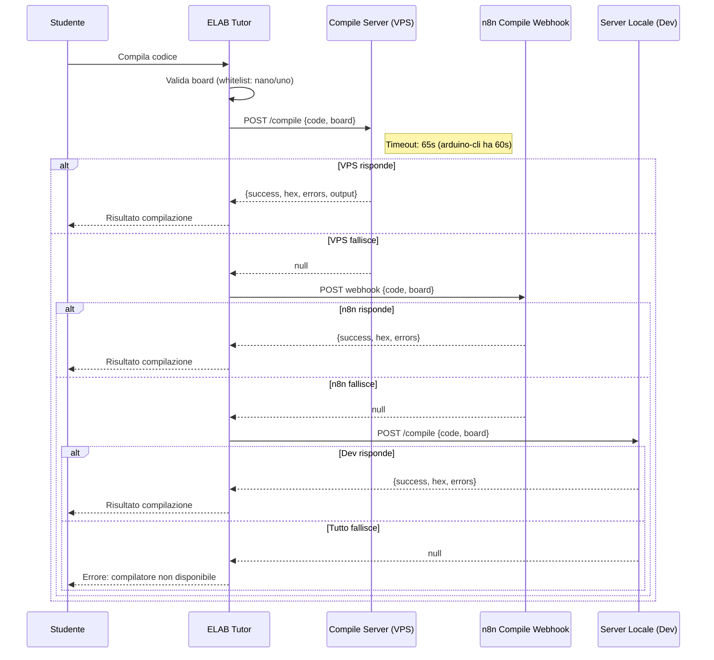

# ELAB Tutor -- Flussi Dati Completi

**Versione:** 1.0
**Data:** 29/03/2026
**Autore:** Andrea Marro
**Target:** Bambini 8-14 anni -- piattaforma STEM educativa

> Questo documento mappa TUTTI i flussi dati reali presenti nel codice sorgente di ELAB Tutor.
> Ogni flusso e' verificato dal codice -- nessuna invenzione.

---

## Indice

1. [Panoramica Architettura](#1-panoramica-architettura)
2. [Flusso AI Chat](#2-flusso-ai-chat)
3. [Flusso Analytics](#3-flusso-analytics)
4. [Flusso Autenticazione](#4-flusso-autenticazione)
5. [Flusso Student Tracking](#5-flusso-student-tracking)
6. [Flusso GDPR](#6-flusso-gdpr)
7. [Flusso Compilazione](#7-flusso-compilazione)
8. [Storage Map](#8-storage-map)

---

## 1. Panoramica Architettura

### Diagramma



```mermaid
graph TB
    subgraph Browser["Browser (Client)"]
        APP["ELAB Tutor<br/>React 19 + Vite 7"]
        LS["localStorage"]
        SS["sessionStorage"]
    end

    subgraph Nanobot["Nanobot Server (Render)"]
        NB_CHAT["/tutor-chat, /chat"]
        NB_DIAG["/diagnose, /hints"]
        NB_VOICE["/voice-chat, /tts, /voice-status"]
        NB_MEM["/memory/sync, /memory/:id"]
        NB_PRELOAD["/preload"]
    end

    subgraph N8N["n8n (Hostinger)"]
        CHAT_WH["Chat Webhook"]
        ANALYTICS_WH["Analytics Webhook"]
        GDPR_WH["GDPR Webhook"]
        COMPILE_WH["Compile Webhook"]
        LICENSE_WH["License Webhook"]
        ADMIN_WH["Admin Webhook"]
    end

    subgraph Auth["Auth Server (Netlify Functions)"]
        AUTH_LOGIN["/auth-login"]
        AUTH_REG["/auth-register"]
        AUTH_ME["/auth-me"]
        AUTH_CLASS["/auth-create-class<br/>/auth-join-class<br/>/auth-list-classes"]
        AUTH_STUDENT["/auth-create-student<br/>/auth-remove-student"]
        AUTH_LICENSE["/auth-activate-license"]
        AUTH_GAMES["/auth-update-class-games"]
        SYNC["/student-data-sync"]
    end

    subgraph Local["Server Locale (Dev)"]
        OLLAMA["elab-local-server<br/>Ollama :8000"]
        LOCAL_COMPILE["Compile locale"]
    end

    subgraph Compile["Compile Server (VPS)"]
        COMPILE_SRV["/compile<br/>arduino-cli"]
    end

    APP -->|"Chat AI"| NB_CHAT
    APP -->|"Diagnosi/Hints"| NB_DIAG
    APP -->|"Voce STT/TTS"| NB_VOICE
    APP -->|"Memory sync"| NB_MEM
    APP -->|"Preload hints"| NB_PRELOAD
    APP -->|"Chat fallback"| CHAT_WH
    APP -->|"Analytics eventi"| ANALYTICS_WH
    APP -->|"GDPR richieste"| GDPR_WH
    APP -->|"Compile fallback"| COMPILE_WH
    APP -->|"Licenze"| LICENSE_WH
    APP -->|"Admin"| ADMIN_WH
    APP -->|"Auth"| AUTH_LOGIN
    APP -->|"Registrazione"| AUTH_REG
    APP -->|"Profilo"| AUTH_ME
    APP -->|"Classi"| AUTH_CLASS
    APP -->|"Studenti"| AUTH_STUDENT
    APP -->|"Licenza"| AUTH_LICENSE
    APP -->|"Giochi classe"| AUTH_GAMES
    APP -->|"Student data sync"| SYNC
    APP -->|"Chat offline"| OLLAMA
    APP -->|"Compile priorita"| COMPILE_SRV
    APP -->|"Compile dev"| LOCAL_COMPILE
    APP <-->|"Persistenza locale"| LS
    APP <-->|"Dati sessione"| SS
```

### Variabili d'Ambiente (Endpoint Esterni)

| Variabile | Servizio | Descrizione |
|-----------|----------|-------------|
| `VITE_NANOBOT_URL` | Nanobot (Render) | Server AI principale: chat, diagnosi, hints, voce, memoria |
| `VITE_N8N_CHAT_URL` | n8n (Hostinger) | Webhook chat AI (fallback dopo nanobot) |
| `VITE_ANALYTICS_WEBHOOK` | n8n (Hostinger) | Webhook analytics (9 tipi di evento) |
| `VITE_N8N_GDPR_URL` | n8n (Hostinger) | Webhook GDPR: export, delete, consent, revoke |
| `VITE_COMPILE_URL` | VPS | Server compilazione standalone (arduino-cli) |
| `VITE_COMPILE_WEBHOOK_URL` | n8n (Hostinger) | Webhook compilazione (fallback) |
| `VITE_AUTH_URL` | Netlify Functions | Server autenticazione (login, register, classi, licenze) |
| `VITE_N8N_LICENSE_URL` | n8n (Hostinger) | Webhook gestione licenze |
| `VITE_ADMIN_WEBHOOK` | n8n (Hostinger) | Webhook admin/Notion |
| `VITE_LOCAL_API_URL` | Locale | Server RAG locale (fallback ricerca) |
| `VITE_LOCAL_COMPILE_URL` | Locale | Compilatore locale (solo dev) |
| `VITE_API_TIMEOUT` | -- | Timeout API in ms (default: 30000) |
| `VITE_EMAIL_PROVIDER` | -- | Provider email: sendgrid o mailgun |
| `VITE_FROM_EMAIL` | -- | Email mittente (default: noreply@elab-stem.com) |

---

## 2. Flusso AI Chat

### Catena di Fallback

Il messaggio dello studente attraversa una catena di fallback a 4 livelli, definita in `sendChat()` (`src/services/api.js`):

```
Studente digita messaggio
    |
    v
[Content Moderation] -- blocca linguaggio inappropriato (regex client-side)
    |
    v
[Master Timeout: 10s testo / 20s immagini]
    |
    v
1. tryLocalServer() -- localhost:8000 (Ollama, 100% offline)
    | fallisce?
    v
2. tryNanobot() -- VITE_NANOBOT_URL/tutor-chat (o /chat per immagini)
    | fallisce?
    v
3. postChatWithRetry() -- VITE_N8N_CHAT_URL (n8n webhook, 1 retry, backoff 400ms)
    | fallisce?
    v
4. RAG Locale -- VITE_LOCAL_API_URL/api/search (ricerca knowledge base)
    | fallisce?
    v
5. searchKnowledgeBase() -- Knowledge base statica locale (zero rete)
```

### Diagramma



### Dati Trasmessi per Livello

| Dato | Origine | Destinazione | Persistenza | Crittografia | Retention |
|------|---------|-------------|-------------|-------------|-----------|
| Messaggio studente (max ~500 char) | Input utente | Local/Nanobot/n8n | No (in-flight) | HTTPS (TLS 1.2+) | Nessuna client-side |
| sessionId (tutor-{ts}-{random}) | localStorage `elab_tutor_session` | Local/Nanobot/n8n | localStorage permanente | No | Permanente fino a cancellazione |
| experimentId | Stato simulatore | Local/Nanobot/n8n | No | HTTPS | Nessuna |
| circuitState (stato componenti) | Simulatore | Local/Nanobot/n8n | No | HTTPS | Nessuna |
| simulatorContext | Contesto attuale | Local/Nanobot | No | HTTPS | Nessuna |
| images [{base64, mimeType}] | Fotocamera/upload | Nanobot/n8n | No | HTTPS | Nessuna client-side |
| unlim_session (s_{uuid}) | sessionStorage | n8n webhook | sessionStorage (tab) | No | Chiusura tab |
| SOCRATIC_INSTRUCTION (system prompt) | Codice client | n8n webhook | No | HTTPS | Nessuna |
| Risposta AI (testo filtrato) | Server AI | Browser | No | HTTPS | Nessuna |

### Endpoint Aggiuntivi Nanobot

| Endpoint | Env Var | Dati Inviati | Scopo |
|----------|---------|-------------|-------|
| `/diagnose` | `VITE_NANOBOT_URL` | circuitState, experimentId | Diagnosi proattiva circuito |
| `/hints` | `VITE_NANOBOT_URL` | experimentId, currentStep, difficulty | Hint progressivi |
| `/preload` | `VITE_NANOBOT_URL` | experimentId | Pre-generazione hint (fire-and-forget) |
| `/voice-status` | `VITE_NANOBOT_URL` | -- | Check capacita STT/TTS |
| `/voice-chat` | `VITE_NANOBOT_URL` | audio blob | Chat vocale (STT + risposta) |
| `/tts` | `VITE_NANOBOT_URL` | testo | Text-to-speech |
| `/memory/sync` | `VITE_NANOBOT_URL` | profilo studente | Sync memoria persistente |
| `/memory/:id` | `VITE_NANOBOT_URL` | -- (GET) | Recupero memoria |

---

## 3. Flusso Analytics

Definito in `src/components/simulator/api/AnalyticsWebhook.js`.

### Diagramma



### 9 Tipi di Evento

| Evento | Costante | Trigger |
|--------|----------|---------|
| `experiment_loaded` | `EVENTS.EXPERIMENT_LOADED` | Apertura esperimento |
| `simulation_started` | `EVENTS.SIMULATION_STARTED` | Play simulazione |
| `simulation_paused` | `EVENTS.SIMULATION_PAUSED` | Pausa simulazione |
| `simulation_reset` | `EVENTS.SIMULATION_RESET` | Reset simulazione |
| `component_interacted` | `EVENTS.COMPONENT_INTERACTED` | Interazione componente |
| `code_viewed` | `EVENTS.CODE_VIEWED` | Apertura editor codice |
| `serial_used` | `EVENTS.SERIAL_USED` | Uso Serial Monitor |
| `volume_selected` | `EVENTS.VOLUME_SELECTED` | Selezione volume |
| `simulator_error` | `EVENTS.ERROR` | Errore simulatore |

### Tabella Dati

| Dato | Origine | Destinazione | Persistenza | Crittografia | Retention |
|------|---------|-------------|-------------|-------------|-----------|
| Tipo evento (stringa) | Simulatore | n8n webhook | No | HTTPS | Definita server-side |
| Timestamp ISO | Client | n8n webhook | No | HTTPS | Definita server-side |
| sessionId (sim-{ts}-{random}) | sessionStorage | n8n webhook | sessionStorage (tab) | No | Chiusura tab |
| Dati aggiuntivi evento | Simulatore | n8n webhook | No | HTTPS | Definita server-side |
| elab_consent ('accepted'/'rejected') | Scelta utente | localStorage | Permanente | No | Permanente fino a revoca |

---

## 4. Flusso Autenticazione

Definito in `src/services/authService.js`. Server: Netlify Functions (`VITE_AUTH_URL`).

### Diagramma



### Endpoint Autenticazione Completi

| Endpoint | Metodo | Dati Inviati | Ruolo Richiesto |
|----------|--------|-------------|-----------------|
| `/auth-login` | POST | email/username, password | Nessuno |
| `/auth-register` | POST | name, surname, email, password, ruolo, userType | Nessuno |
| `/auth-me` | GET | Bearer token (header) | Autenticato |
| `/auth-activate-license` | POST | licenseCode | Autenticato |
| `/auth-create-student` | POST | username, password?, className? | Docente |
| `/auth-create-class` | POST | name | Docente |
| `/auth-join-class` | POST | classCode | Studente |
| `/auth-list-classes` | GET | Bearer token | Docente |
| `/auth-remove-student` | POST | classId, studentId | Docente |
| `/auth-update-class-games` | POST | classId, activeGames[] | Docente |
| `/student-data-sync` | POST/GET | studentData (POST) / classId (GET) | Autenticato |

### Tabella Dati

| Dato | Origine | Destinazione | Persistenza | Crittografia | Retention |
|------|---------|-------------|-------------|-------------|-----------|
| Email | Input utente | Auth server | Server-side (Notion) | HTTPS + hashing server | Account lifetime |
| Password | Input utente | Auth server | Mai in chiaro (hash server) | HTTPS | Mai salvata client |
| HMAC Token | Auth server | localStorage `elab_auth_token` | localStorage permanente | Token firmato HMAC | Scadenza nel payload |
| Rate limit state | Client | sessionStorage `elab_auth_ratelimit` | sessionStorage (tab) | No | Chiusura tab |
| Nome, cognome, ruolo | Input utente | Auth server | Server-side | HTTPS | Account lifetime |
| License code | Input utente | Auth server | Server-side | HTTPS | Account lifetime |

---

## 5. Flusso Student Tracking

Due servizi cooperano:
- **studentTracker** (`src/services/studentTracker.js`) -- bridge tra eventi simulatore e persistenza
- **studentService** (`src/services/studentService.js`) -- layer di persistenza localStorage + sync server

### Diagramma



### Struttura Dati Studente (localStorage `elab_student_data`)

```json
{
  "userId": "uuid-generato",
  "esperimenti": [{"experimentId", "nome", "volume", "capitolo", "durata", "completato", "note", "timestamp"}],
  "tempoTotale": 0,
  "sessioni": [{"id", "inizio", "fine", "durata", "attivita": [{"tipo", "dettaglio", "timestamp"}]}],
  "concetti": [{"concettoId", "nome", "categoria", "visite", "primaVisita", "ultimaVisita"}],
  "diario": [{"tipo", "contenuto", "screenshot", "esperimentoId", "mood", "timestamp"}],
  "confusione": [{"livello 0-10", "contesto", "concettoId", "timestamp"}],
  "meraviglie": [{"domanda", "contesto", "concettoId", "risolta", "risposta", "timestamp"}],
  "difficolta": [{"descrizione", "concettoId", "esperimentoId", "risolta", "timestamp"}],
  "moods": [{"mood", "nota", "timestamp"}],
  "stats": {"giorniConsecutivi", "ultimoGiornoAttivo", "esperimentiTotali", "mediaConfusione", "meraviglieTotali", "tempoMedioSessione"},
  "creato": "ISO",
  "ultimoSalvataggio": "ISO"
}
```

### Tabella Dati

| Dato | Origine | Destinazione | Persistenza | Crittografia | Retention |
|------|---------|-------------|-------------|-------------|-----------|
| Device ID (UUID) | crypto.randomUUID() | localStorage `elab_device_id` | Permanente | No | Permanente |
| Nome studente | Input utente | localStorage `elab_student_name` | Permanente | No | Permanente |
| Dati studente (JSON completo) | Attivita simulatore | localStorage `elab_student_data` | Permanente | No | Permanente fino a cancellazione GDPR |
| Dati studente sync | localStorage | Auth server `/student-data-sync` | Server-side | HTTPS + Bearer token | Definita server-side |
| Sessioni (inizio/fine/durata) | Tracker | localStorage | Permanente | No | Permanente |
| Attivita (tipo/dettaglio) | Eventi simulatore | localStorage | Permanente | No | Permanente |
| Riflessioni | Input utente | localStorage `elab_reflections` | Permanente (max 200) | No | FIFO 200 elementi |

---

## 6. Flusso GDPR

Definito in `src/services/gdprService.js` e `src/components/common/ConsentBanner.jsx`.

### Diagramma



### Stati del Consenso

| Stato | Significato | Analytics Attivi | Azione Necessaria |
|-------|------------|-----------------|-------------------|
| `null` (assente) | Nessuna scelta | NO | Mostra banner |
| `pending` | In attesa | NO | Mostra banner |
| `parental_required` | Serve consenso genitore | NO | Workflow parentale |
| `parental_sent` | Email inviata al genitore | NO | Attesa verifica |
| `parental_verified` | Genitore ha confermato | SI | Nessuna |
| `accepted` | Consenso dato (>= 16 anni) | SI | Nessuna |
| `rejected` | Consenso rifiutato | NO | Nessuna |
| `revoked` | Consenso revocato | NO | Nessuna |

### Azioni GDPR Webhook

| Azione | Articolo GDPR | Dati Inviati | Effetto |
|--------|--------------|-------------|---------|
| `export` | Art. 20 (Portabilita) | userId | Esportazione dati utente |
| `delete` | Art. 17 (Oblio) | userId, password, reason, timestamp | Eliminazione dati + clearLocalData() |
| `correct` | Art. 16 (Rettifica) | userId, corrections | Rettifica dati |
| `revoke` | Art. 7 (Revoca) | userId | Revoca consenso |
| `parental-consent` | COPPA / Art. 8 | childName, childAge, parentEmail, parentName, requiresCOPPA | Richiesta consenso genitore |
| `verify-parental-consent` | COPPA / Art. 8 | token | Verifica consenso genitore |

### Tabella Dati

| Dato | Origine | Destinazione | Persistenza | Crittografia | Retention |
|------|---------|-------------|-------------|-------------|-----------|
| Stato consenso (JSON) | Scelta utente | localStorage `elab_gdpr_consent` | Permanente | No | Permanente fino a revoca |
| Consenso semplificato | Scelta utente | localStorage `elab_consent_v2` | Permanente | No | Permanente |
| Eta utente | Input/sessione | sessionStorage `elab_user_age` | sessionStorage (tab) | No | Chiusura tab |
| Email genitore | Input genitore | GDPR webhook | No (transit) | HTTPS | Definita server-side |
| Nome bambino | Input genitore | GDPR webhook | No (transit) | HTTPS | Definita server-side |
| userId per richieste | Client | GDPR webhook | No (transit) | HTTPS | Nessuna |
| Password (per delete) | Input utente | GDPR webhook | No (transit) | HTTPS | Nessuna |

### Funzioni Privacy by Design

| Funzione | Scopo |
|----------|-------|
| `minimizeData(data, allowedFields)` | Riduce campi ai soli consentiti |
| `pseudonymizeUserId(userId)` | SHA-256 con salt (irreversibile, troncato 16 char) |
| `isDataExpired(date, maxDays=730)` | Verifica retention policy (default 2 anni) |
| `clearLocalData()` | Elimina TUTTE le chiavi `elab_*` da localStorage e sessionStorage |

---

## 7. Flusso Compilazione

Definito in `compileCode()` in `src/services/api.js`.

### Catena di Fallback

```
Codice Arduino (.ino)
    |
    v
1. VITE_COMPILE_URL/compile -- Server standalone VPS (arduino-cli, priorita)
    | fallisce?
    v
2. VITE_COMPILE_WEBHOOK_URL -- n8n webhook (fallback)
    | fallisce?
    v
3. VITE_LOCAL_COMPILE_URL/compile -- Server locale (solo dev)
    | fallisce?
    v
Errore: "Il traduttore del codice non risponde"
```

### Diagramma



### Board Consentite (Whitelist)

| FQBN | Descrizione |
|------|-------------|
| `arduino:avr:nano:cpu=atmega328old` | Arduino Nano (default) |
| `arduino:avr:uno` | Arduino Uno |

### Tabella Dati

| Dato | Origine | Destinazione | Persistenza | Crittografia | Retention |
|------|---------|-------------|-------------|-------------|-----------|
| Codice sorgente (.ino) | Editor studente | Compile server | No (in-flight) | HTTPS | Nessuna client-side |
| Board FQBN | Configurazione | Compile server | No | HTTPS | Nessuna |
| File .hex compilato | Compile server | Browser (in-memory) | No | HTTPS | Solo runtime |
| Errori compilazione | Compile server | Browser (display) | No | HTTPS | Solo runtime |

---

## 8. Storage Map

### localStorage -- Chiavi Persistenti

| Chiave | Tipo Dato | Scopo | Retention | Sensibilita |
|--------|-----------|-------|-----------|-------------|
| `elab_device_id` | UUID string | Identificativo dispositivo/browser | Permanente | Media -- pseudoidentificatore |
| `elab_student_name` | Stringa | Nome visualizzato studente | Permanente | Media -- dato personale |
| `elab_student_data` | JSON complesso | Tutti i dati studente: esperimenti, sessioni, concetti, diario, confusione, meraviglie, difficolta, mood, statistiche | Permanente | Alta -- profilo completo attivita |
| `elab_reflections` | JSON array (max 200) | Riflessioni studente sugli strumenti | Permanente (FIFO 200) | Bassa |
| `elab_tutor_session` | String (tutor-{ts}-{random}) | ID sessione per chat AI | Permanente | Bassa |
| `elab_auth_token` | HMAC token string | Token autenticazione | Permanente (scadenza nel token) | Alta -- credenziale |
| `elab_gdpr_consent` | JSON {status, timestamp, version, age} | Stato consenso GDPR completo | Permanente | Media -- dato preferenza |
| `elab_consent` | 'accepted' / 'rejected' | Consenso analytics semplificato (letto da AnalyticsWebhook) | Permanente | Bassa |
| `elab_consent_v2` | 'accepted' / 'rejected' | Consenso v2 (ConsentBanner) | Permanente | Bassa |
| `elab_active_volume` | Numero (1/2/3) | Volume attualmente selezionato | Permanente | Bassa |
| `elab_unlim_memory` | JSON complesso | Profilo apprendimento UNLIM: esperimenti completati, quiz, errori comuni, riassunti sessione | Permanente | Media -- profilo pedagogico |
| `elab-notebooks` | JSON array | Appunti/notebook salvati studente | Permanente | Media |
| `elab_tutor_slides` | JSON array | Slide tutor personalizzate | Permanente | Bassa |
| `elab_session_log` | JSON array (max 500) | Log sessioni tutor | Permanente (max 500) | Bassa |
| `elab_project_history` | JSON object | Cronologia progetti | Permanente | Bassa |
| `elab_license_history` | JSON array | Storico attivazioni licenza (admin) | Permanente | Media |
| `elab_current_user` | JSON | Profilo utente corrente (criptato) | Permanente | Alta -- dato personale |
| `elab-tts-muted` | Boolean string | Preferenza muto TTS | Permanente | Bassa |
| `elab_unlim_mode` | Boolean string | Modalita UNLIM attiva/disattiva | Permanente | Bassa |
| `elab_onboarding_done` | '1' | Flag onboarding completato | Permanente | Bassa |
| `elab_hint_seen_*` | 'true' | Flag hint contestuali gia visti | Permanente | Bassa |
| `elab_circuit_detective_solved` | JSON array | Puzzle Circuit Detective completati | Permanente | Bassa |
| `elab_reverse_lab_solved` | JSON array | Puzzle Reverse Engineering Lab completati | Permanente | Bassa |
| `elab_game_scores_*` | JSON object | Punteggi giochi per gioco | Permanente | Bassa |
| `elab_sessions` | JSON array | Storico sessioni (useSessionTracker) | Permanente | Bassa |
| `elab_gest_impostazioni` | JSON | Impostazioni gestionale (admin) | Permanente | Media |
| `elab_gest_log` | JSON array (max 500) | Log operazioni gestionale | Permanente | Media |
| `elab_gest_sdi_*` | JSON | Fatture elettroniche SDI (admin) | Permanente | Alta -- dati fiscali |
| `elab_gest_sdi_counter` | Numero | Contatore fatture SDI | Permanente | Bassa |
| `elab_gest_notif_read` | JSON array | Notifiche lette gestionale | Permanente | Bassa |

### sessionStorage -- Chiavi di Sessione (Tab)

| Chiave | Tipo Dato | Scopo | Retention | Sensibilita |
|--------|-----------|-------|-----------|-------------|
| `elab-sim-session` | String (sim-{ts}-{random}) | ID sessione simulatore per analytics | Chiusura tab | Bassa |
| `unlim_session` | String (s_{uuid}) | ID sessione chat UNLIM per webhook | Chiusura tab | Bassa |
| `elab_rate_minute` | Numero | Contatore rate limit chat (messaggi/minuto) | Chiusura tab | Bassa |
| `elab_rate_minute_start` | Timestamp | Inizio finestra rate limit | Chiusura tab | Bassa |
| `elab_auth_ratelimit` | JSON {attempts, lockedUntil} | Rate limit login (max 5, lockout 15 min) | Chiusura tab | Bassa |
| `elab_auth_token` | HMAC token | Token auth (studentService lo legge da qui) | Chiusura tab | Alta -- credenziale |
| `elab_license` | JSON {verified, expiry} | Cache stato licenza | Chiusura tab | Bassa |
| `elab_auth` | JSON | Cache auth licenza | Chiusura tab | Media |
| `elab_session_secret` | UUID | Segreto sessione per crypto | Chiusura tab | Alta -- segreto crittografico |
| `elab_user_age` | Numero | Eta utente (per COPPA check) | Chiusura tab | Media -- dato personale minore |
| `elab_last_error` | JSON | Ultimo errore catturato (ErrorBoundary) | Chiusura tab | Bassa |
| `elab_current_user` | JSON | Profilo utente corrente (sessione) | Chiusura tab | Alta -- dato personale |
| `elab_session_id` | String | ID sessione licenza | Chiusura tab | Bassa |
| `elab_ratelimit_*` | JSON | Rate limit userService | Chiusura tab | Bassa |

### Utilities Crittografia

Il modulo `src/utils/crypto.js` fornisce:
- `secureStore(key, data)` -- salva in localStorage con crittografia AES
- `secureRetrieve(key)` -- legge e decripta da localStorage
- `secureRemove(key)` -- rimuove dato criptato

Usato per `elab_current_user` in localStorage (il profilo utente e' criptato).

---

## Note Finali

### Principi di Protezione Dati Applicati

1. **Minimizzazione**: i dati analytics sono anonimizzati (nessun ID persistente negli eventi)
2. **Consenso preventivo**: analytics bloccati fino a consenso esplicito (`hasAnalyticsConsent()`)
3. **COPPA compliance**: workflow consenso parentale per eta < 13 anni
4. **Diritto all'oblio**: `clearLocalData()` elimina tutte le chiavi `elab_*`
5. **Pseudonimizzazione**: `pseudonymizeUserId()` con SHA-256 + salt
6. **Retention policy**: `isDataExpired()` verifica scadenza (default 2 anni)
7. **Security by design**: password validate client-side (8+ char, maiuscola, numero, speciale), rate limiting su login e chat, sessionStorage per dati sensibili di sessione
8. **Fallback locale**: il sistema funziona interamente offline con localStorage -- nessun dato lascia il browser senza connessione

### Servizi Esterni Coinvolti

| Servizio | Hosting | Tipo Dato | GDPR Rilevante |
|----------|---------|-----------|---------------|
| Nanobot | Render.com | Messaggi chat, circuitState, audio, memoria studente | Si -- contiene conversazioni |
| n8n Webhooks | Hostinger | Chat (fallback), analytics, GDPR requests, compilazione, licenze | Si -- routing dati |
| Auth Server | Netlify | Email, password hash, profili, classi, licenze | Si -- dati personali |
| Compile Server | VPS | Codice sorgente Arduino | No -- nessun dato personale |
| Ollama | localhost | Chat offline | No -- tutto locale |
