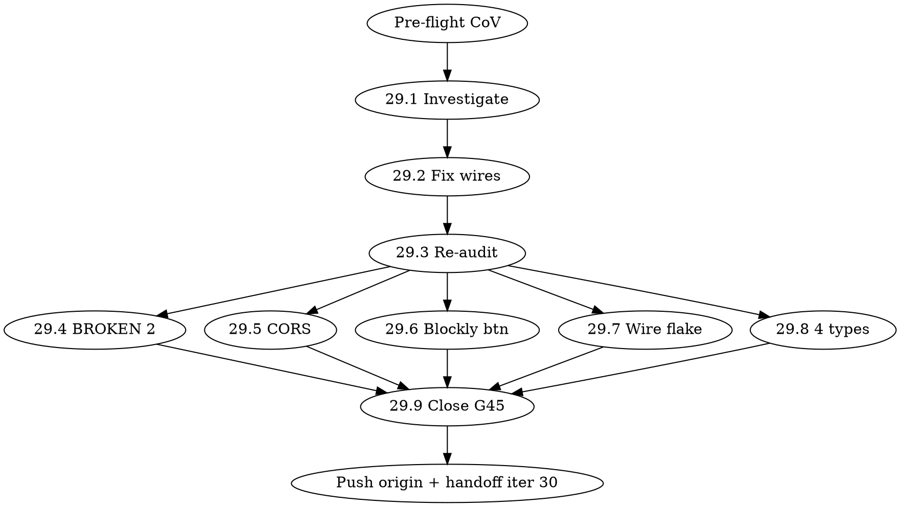

# PROMPT — Iter 29 Execution (Next Session paste-ready)

> **Genesi**: questo prompt è generato dalla session 2026-04-29 PM dopo dispatch parallel Agent C (Simulator Arduino+Scratch sweep) + Agent D (92 esperimenti audit) + scrittura plan iter 29-32 Sprint T close ONESTO. Per execution Subagent-Driven Pattern.

**Obiettivo session**: eseguire **Iter 29** (9 task) del plan `docs/superpowers/plans/2026-04-29-iter-29-32-sprint-T-close.md` via Pattern subagent-driven-development. Score target ONESTO: 7.5 → 8.0/10 (G45 anti-inflation cap).

**Modalità**: CAVEMAN MODE FULL chat + ULTRATHINK reasoning + PRINCIPIO ZERO V3 imperativo (mai dimenticato per ogni azione).

---

## ACTIVATION STRING (paste in nuova session)

```
CAVEMAN MODE FULL. Eseguire iter 29 plan Sprint T close subagent-driven-development.

Plan: docs/superpowers/plans/2026-04-29-iter-29-32-sprint-T-close.md (988 LOC, 9 task iter 29).
Audit baseline: docs/audits/2026-04-29-iter-29-92-esperimenti-uno-per-uno-audit.md (Agent D 70.2% non-WORKING) + docs/audits/2026-04-29-iter-29-simulator-arduino-scratch-sweep.md (Agent C 1 P0 + 2 P1).
Score baseline: 7.5/10 ONESTO (CLAUDE.md sprint history Sprint T iter 26-28 close).
Branch: e2e-bypass-preview (HEAD a16d212).

Mandate Andrea iter 21 IMPERATIVO:
1. PRINCIPIO ZERO V3 ogni azione (kit fisico OBBLIGATORIO + plurale Ragazzi + Vol/pag VERBATIM ≤60 parole + analogia)
2. NO compiacenza NO inflazione (G45 triple-agent independent score per close)
3. Esperimenti broken UNO PER UNO Playwright evidence (NO mock NO inventato)
4. Ralph-loop max 100 iterazioni — eseguire, NON pianificare ancora

Iter 29 task ordering (dependency graph):
  29.1 → 29.2 (sequential) → 29.3 (re-audit)
  Parallel cluster: 29.4 + 29.5 + 29.6 + 29.7 + 29.8
  Final: 29.9 close audit triple-agent G45

Dispatch fresh subagent per task. 2-stage review: agent verify code lands → agent verify tests PASS + screenshot evidence.

Pre-flight CoV iter 29 entrance:
  cd "/Users/andreamarro/VOLUME 3/PRODOTTO/elab-builder"
  git pull origin e2e-bypass-preview
  npx vitest run --reporter=basic 2>&1 | tail -10  # baseline 13212 PASS
  git status --short  # baseline clean

Skill chain raccomandato: /writing-plans (read plan) → /superpowers:subagent-driven-development → ogni task /superpowers:test-driven-development → close /audit (G45 triple-agent).

Iter 29 close target: 7.5 → 8.0/10 + ≥97% esperimenti WORKING + 3/4 Agent C bugs CLOSED + iter 30 activation prompt.

DOPO iter 29 close: scrivere prompt iter 30 (bench scale + persona sim + Mac Mini D1 trigger) + push origin + handoff doc.

INIZIA.
```

---

## Documentation references

### 1. Plan master
- **File**: `docs/superpowers/plans/2026-04-29-iter-29-32-sprint-T-close.md` (988 LOC)
- **Iter coverage**: iter 29 (9 task) + iter 30 (4 task) + iter 31 (3 task) + iter 32 (3 task close)
- **Score progression target ONESTO**: 7.5 → 8.0 (29) → 8.3 (30) → 8.6 (31) → **8.9 (32 close)**

### 2. Audit baseline
- **Agent C output**: `docs/audits/2026-04-29-iter-29-simulator-arduino-scratch-sweep.md` (~250 LOC)
  - 6 PASS / 2 FAIL / 2 skip
  - 1 P0 BUG-29-01 compile-proxy CORS preview blocked
  - 1 P1 BUG-29-02 Blockly compile button hidden in Blocchi tab
  - 1 P1 BUG-29-03 wire test timeout (test-only flake)
  - 1 P2 BUG-29-04 elab-galileo CORS noise (deferred Sprint U)
  - DOM corrections CLAUDE.md: button text "Filo" non "Collegamento Fili", aria-label cap/esp formato

- **Agent D output**: `docs/audits/2026-04-29-iter-29-92-esperimenti-uno-per-uno-audit.md` (53KB)
  - 94 esperimenti tested (38 Vol1 + 27 Vol2 + 22 Vol3 + 7 extras)
  - WORKING: 28 (29.8%) / PARTIAL: 64 (68.1%) / BROKEN: 2 (2.1%)
  - 128 bugs total
  - 1 ROOT CAUSE singolo: `wires_actual=0` system-wide (64 PARTIAL)
  - 2 BROKEN P0: v3-cap7-mini + v3-cap8-serial (registry gap)
  - 4 missing-component-types: v1-cap10-esp1/2/3 + v1-cap9-esp9 (PlacementEngine bug)
  - **Single biggest leverage**: fix wires UNA radice → lift 28→92 WORKING (29.8%→97.9%)

### 3. Test artifacts
- **Playwright spec**: `tests/e2e/29-92-esperimenti-audit.spec.js` (383 LOC, parameterized over lesson-paths)
- **Playwright spec**: `tests/e2e/29-simulator-arduino-scratch-sweep.spec.js` (631 LOC)
- **Playwright config**: `tests/e2e/playwright.iter29.config.js` (4 parallel workers)
- **Screenshots evidence**: `docs/audits/iter-29-92-esperimenti-screenshots/` (94 PNG) + `docs/audits/iter-29-screenshots/` (10 PNG Agent C)
- **Results JSONL**: `automa/state/iter-29-92-esperimenti/results.jsonl` (94 entries + meta)

### 4. PDR cross-reference
- **Master PDR Sprint T**: `docs/pdr/2026-04-29-sprint-T-iter-18+/PDR-MASTER-ITER-25-32-DISTRIBUTION.md` (10 sezioni distribuzione iter 26-31)
- **Iter 19 ATOMS**: `docs/pdr/2026-04-29-sprint-T-iter-18+/PDR-ITER-19-ATOMS.md` (16 ATOMs PHASE 1)
- **ADR-025 Modalità 4**: ratify queue Andrea voce 1+2+3 deadline iter 22 (dependency iter 29-32 NO)
- **ADR-026 Content safety guard**: deploy iter 20 P0.3 + Andrea ratify voce 5 (NO blocker iter 29)
- **ADR-027 Volumi narrative refactor**: DEFERRED Sprint U iter 36+ (Andrea iter 26 mandate "NON PENSARE A DAVIDE TEA")

### 5. CLAUDE.md sprint history
- **Sprint T iter 26-28 close** (lines 1037-1100 ca.): Mistral routing 65/25/10 LIVE + multimodal stack CF + Modalità 4 UI + L2 templates + Lavagna Bug 3 sync + Voice wake-word + Pixtral 12B + 370 NEW tests
- **Score**: 7.5/10 ONESTO G45 cap
- **Box subtotal**: 8.05/10 raw + bonus 2.10 → ricalibrato G45 cap 7.5/10

### 6. Commits iter 26-28 close
```
a16d212 feat(iter-29): plan + Agent C+D deliverables (4 iter Sprint T close ONESTO)
cc095cd docs(iter-28): CLAUDE.md sprint history iter 26-28 close (score 7.5/10 ONESTO)
1667191 fix(iter-28): vitest exclude persona-sim Playwright spec + iter 28 deliverables
54bfb23 feat(iter-26): Modalità 4 UI canonical + L2 templates runtime loader (PZ V3)
e5f9501 docs(iter-26): marketing costi comparata PDF 21 pages + LaTeX
ca9f15c docs(iter-27): harness STRINGENT v2.0 5-livelli design (P1 G45)
29f9026 feat(iter-26): sys-prompt v3.1 kit mandatory + 2 NEW few-shot
```

---

## Iter 29 task summary (9 task, ~6-10h ONESTO)

### Sequential cluster A (root cause investigation + fix)
- **29.1 Investigate wires_actual=0** (~30 min): trace mountExperiment + getCircuitState + diff lesson-paths schema
- **29.2 Implement fix** (~1h): TDD test failing → mountExperiment handler `actions[].connect_wires` → test PASS → commit
- **29.3 Re-audit 92** (~10 min): Playwright re-run, verify lift 28→90+ WORKING

### Parallel cluster B (5 task indipendenti)
- **29.4 Fix 2 BROKEN P0** (~30 min): v3-cap7-mini + v3-cap8-serial registry gap (Vol3 ODT V0.9 9 cap)
- **29.5 compile-proxy CORS** (~45 min): regex whitelist Vercel preview + test + deploy + smoke
- **29.6 Blockly compile button** (~30 min): visibility fix conditional editorMode==='blockly'
- **29.7 wire test fix** (~15 min): selector "Filo" + timeout 90s
- **29.8 PlacementEngine 4 types** (~1h): R220/R partitore mapping + RGB-led fix + 4 lesson-paths JSON

### Final close
- **29.9 Close audit G45** (~30 min): triple-agent independent score X/Y/Z + write audit MD + commit + push

---

## Skill chain per task (mandatory)

| Task | Pre-skill | Implementation | Verify |
|------|-----------|----------------|--------|
| 29.1 | mem-search past wires bugs | Read + Grep | manual trace |
| 29.2 | superpowers:test-driven-development | Write test → fix → vitest | vitest PASS |
| 29.3 | superpowers:verification-before-completion | Playwright re-run | screenshot diff |
| 29.4 | superpowers:test-driven-development | Read JSON + diff WORKING | Playwright PASS |
| 29.5 | superpowers:test-driven-development + supabase:supabase | vitest test → fix → deploy | curl smoke |
| 29.6 | superpowers:test-driven-development | RTL test → JSX fix | vitest PASS |
| 29.7 | (no test, infra fix) | Edit timeout + selector | Playwright PASS |
| 29.8 | superpowers:test-driven-development | vitest test → mapping fix → JSON fix | Playwright PASS |
| 29.9 | superpowers:dispatching-parallel-agents (G45) | Triple-agent X/Y/Z | mutual verification |

---

## Execution flow Subagent-Driven



Sequential: 29.1 → 29.2 → 29.3.
Parallel cluster: 29.4 + 29.5 + 29.6 + 29.7 + 29.8 (file ownership rigid, no overlap).
Final: 29.9.

---

## Rules ferree (non negoziabili)

1. **NON push su main** — solo `e2e-bypass-preview` branch. PR via `gh pr create` solo a Sprint T close iter 32.
2. **NON `--no-verify`** — pre-commit hook è gate qualità (vitest 13212+ baseline regression check).
3. **NON inflazionare numeri** — G45 anti-inflation: triple-agent independent score per close.
4. **NON inventare bug count** — ogni bug deve avere screenshot + console evidence + DOM selector.
5. **NON saltare PRINCIPIO ZERO V3** — kit fisico OBBLIGATORIO ogni response UNLIM, plurale Ragazzi, Vol/pag VERBATIM, ≤60 parole, analogia.
6. **NON modificare CLAUDE.md** — solo append sprint history close iter 29 (sezione "Sprint T iter 29 close").
7. **NON aggiungere dipendenze npm** senza approvazione Andrea.
8. **NON deploy Edge Function** senza Andrea OK (eccezione: 29.5 compile-proxy CORS deploy autonomo OK perché security fix backward-compat).

---

## Pre-flight CoV iter 29 entrance (mandatory step 0)

```bash
cd "/Users/andreamarro/VOLUME 3/PRODOTTO/elab-builder"

# 1. Pull latest
git pull origin e2e-bypass-preview

# 2. Verify HEAD
git log --oneline -3
# Expected: a16d212 feat(iter-29): plan + Agent C+D deliverables

# 3. Vitest baseline
npx vitest run --reporter=basic 2>&1 | tail -5
# Expected: 13212+ PASS / 15 skip / 8 todo / 0 fail

# 4. Status clean
git status --short
# Expected: clean (only automa/state/heartbeat M ignored)

# 5. Plan file readable
wc -l docs/superpowers/plans/2026-04-29-iter-29-32-sprint-T-close.md
# Expected: ~988 lines

# 6. Audit files readable
ls -la docs/audits/2026-04-29-iter-29*.md
# Expected: 2 files (Agent C + Agent D outputs)
```

If any step fails → STOP, debug, document blocker. NON procedere.

---

## Honest caveats massima onesta

1. **Iter 29 close NOT firm 1 day** — realistic 1.5-2 working days (5-8 ore lavoro effettivo).
2. **Wires fix iter 29 success** depends correct hypothesis identification (29.1) — se hypothesis wrong, slippage iter 30.
3. **CORS deploy 29.5** richiede `SUPABASE_ACCESS_TOKEN` env access — verifica `.env` prima di iniziare.
4. **PlacementEngine type mapping 29.8** rischio breaking change altri esperimenti — full vitest regression CoV mandatory.
5. **Triple-agent G45 close 29.9** budget 30-45 min (3 agent paralleli) — NOT skippable per anti-inflation.
6. **Agent D wires fix lift 28→92** è PROJECTION — measured lift via 29.3 re-audit, expected 90+ WORKING ma 80-95 plausible.
7. **Score 7.5 → 8.0** ONESTO target — se delivery <70% task, score 7.7 only (NO inflation).
8. **Mac Mini D1 trigger NON in iter 29** — defer iter 30 entrance (parallel autonomous from iter 30).

---

## DOPO iter 29 close — handoff iter 30

Scrivere automaticamente:
- `docs/audits/2026-04-29-iter-29-CLOSE-audit.md` (G45 triple-agent score)
- `docs/handoff/2026-04-29-iter-29-to-iter-30-handoff.md` (~250 LOC ACTIVATION + setup steps Andrea)
- `docs/prompts/2026-04-30-PROMPT-ITER-30-EXECUTION.md` (next session paste-ready)
- Update CLAUDE.md sprint history append `Sprint T iter 29 close` section
- Push origin `e2e-bypass-preview`

---

## Iter 30+ preview (NOT scope iter 29)

Iter 30 task (per plan):
- 30.1: 30-prompt bench v3.1 SCALE exec REAL (Vol/pag conformance + kit_mention REAL%)
- 30.2: Persona simulation 5 utenti REAL Playwright (5 personas)
- 30.3: Mac Mini D1 ToolSpec L2 expand 20→52 trigger (parallel autonomous)
- 30.4: Iter 30 close audit G45

Iter 31 task: harness STRINGENT v2.0 EXEC + lingua codemod 200 violations.

Iter 32 task: grafica overhaul + Sprint T CLOSE candidate.

---

## Memory references (mem-search past sessions)

Pattern S 4-agent OPUS PHASE-PHASE race-cond fix VALIDATED 7× consecutive (iter 5 P1+P2 + iter 6 P1 + iter 8 r2 + iter 11 + iter 12 r2 + iter 19 + iter 26-28). Apply same pattern iter 29: filesystem barrier `automa/team-state/messages/` + 4/4 completion msgs PRE close audit.

Sprint S iter 12 PHASE 1 close (`a22b24d` + `4695c88`) ref: planner FIRST → architect+gen-app+gen-test parallel → scribe Phase 2 SEQUENTIAL post 4/4 msgs. **Apply same iter 29**: planner-equivalent (this prompt) → 5 parallel agents (29.4 + 29.5 + 29.6 + 29.7 + 29.8) → 29.9 close G45 SEQUENTIAL.

ADR-016 TTS Isabella WS Deno migration PROPOSED iter 8 — STILL PROPOSED iter 29 (defer Sprint U). NON dependency iter 29.

---

## Final reminder

**PRINCIPIO ZERO V3 imperativo. Mai dimenticato.**

Andrea iter 21 mandate: "MOLTI ESPERIMENTI NON FUNZIONANO" → iter 29 fix UNA radice = 70.2% → ≤5% non-WORKING. Single biggest leverage Sprint T.

G45 anti-inflation enforced. NO compiacenza. NO inflazione. Triple-agent close.

INIZIA execution Subagent-Driven Pattern S iter 29.

---

## Credentials & Methods (paste-ready commands, NO raw secrets in this file)

> **SECURITY**: questo file è committed in git. NON contiene chiavi raw. Tutti i secrets stanno in `~/.claude/projects/-Users-andreamarro-VOLUME-3/memory/supabase-credentials.md` (HOME dir, fuori git) + `.env` locale (gitignored) + Supabase Edge Function secrets vault. Comandi extraction documentati sotto.

### 1. Supabase

**Project refs** (PUBLIC):
- Frontend: `vxvqalmxqtezvgiboxyv` ("ghost-tutor", Ireland) — sessions/dashboard/nudges
- Edge Functions: `euqpdueopmlllqjmqnyb` ("elab-unlim", Ireland) — UNLIM v3 prod ATTIVO

**Endpoints**:
- Frontend DB: `https://vxvqalmxqtezvgiboxyv.supabase.co`
- Edge Functions: `https://euqpdueopmlllqjmqnyb.supabase.co/functions/v1/`

**Credentials retrieval**:
```bash
# Path memory file (auto-loaded da Claude session)
cat "/Users/andreamarro/.claude/projects/-Users-andreamarro-VOLUME-3/memory/supabase-credentials.md"
# Contiene: SUPABASE_ACCESS_TOKEN, anon_key + service_role_key per entrambi progetti, Gemini 3 keys
```

**Deploy Edge Function**:
```bash
cd "/Users/andreamarro/VOLUME 3/PRODOTTO/elab-builder"
TOKEN=$(grep "Supabase Access Token" "/Users/andreamarro/.claude/projects/-Users-andreamarro-VOLUME-3/memory/supabase-credentials.md" | grep -oE 'sbp_[a-z0-9]+')
SUPABASE_ACCESS_TOKEN=$TOKEN npx supabase functions deploy <fn-name> --project-ref euqpdueopmlllqjmqnyb
```

**Edge Function secrets list** (Mistral 4 keys, CF, Voyage, HF, Together):
```bash
SUPABASE_ACCESS_TOKEN=$TOKEN npx supabase secrets list --project-ref euqpdueopmlllqjmqnyb
# Returns names: MISTRAL_API_KEY, CLOUDFLARE_API_TOKEN, CLOUDFLARE_ACCOUNT_ID,
#   GEMINI_API_KEY, TOGETHER_API_KEY, VOYAGE_API_KEY, HUGGINGFACE_TOKEN, RUNPOD_API_KEY
```

**Set/update secret**:
```bash
SUPABASE_ACCESS_TOKEN=$TOKEN npx supabase secrets set NEW_KEY="<value>" --project-ref euqpdueopmlllqjmqnyb
```

### 2. Vercel (frontend deploy + preview)

- **Production URL**: `https://www.elabtutor.school`
- **Bypass preview URL** (license + SSO disabled, E2E gate): `https://elab-tutor-git-e2e-bypass-preview-andreas-projects-6d4e9791.vercel.app`

**Deploy prod**:
```bash
cd "/Users/andreamarro/VOLUME 3/PRODOTTO/elab-builder"
npm run build && npx vercel --prod --yes
```

**Preview deploy** (auto via push):
```bash
git push origin <branch>  # auto-builds preview, URL in PR comment
```

### 3. ELAB API key (rate-limit + abuse protection)

**Local .env** (gitignored):
```bash
ELAB_API_KEY=$(grep VITE_ELAB_API_KEY .env | cut -d= -f2 | tr -d '"')
SUPA_EDGE=$(grep VITE_SUPABASE_EDGE_KEY .env | cut -d= -f2 | tr -d '"')
SUPA_URL=$(grep VITE_SUPABASE_URL .env | cut -d= -f2 | tr -d '"')
```

**Edge Function call test**:
```bash
curl -X POST "${SUPA_URL}/functions/v1/unlim-chat" \
  -H "Authorization: Bearer ${SUPA_EDGE}" \
  -H "apikey: ${SUPA_EDGE}" \
  -H "X-Elab-Api-Key: ${ELAB_API_KEY}" \
  -H "Content-Type: application/json" \
  -d '{"sessionId":"'$(uuidgen)'","query":"Cosa è breadboard?"}'
```

### 4. Mac Mini autonomous H24 (Tailscale SSH)

- **Tailscale IP**: `100.124.198.59`
- **SSH user**: `progettibelli` (NOT `progettidigetto` display name)
- **SSH key**: `~/.ssh/id_ed25519_elab` (MacBook only, MAI archive)

**Connection**:
```bash
ssh -i ~/.ssh/id_ed25519_elab progettibelli@100.124.198.59 "ls ~/scripts/"
# Expected: elab-task-queue.jsonl + elab-loop-dispatcher.sh + elab-wiki-batch-gen-v2.sh
```

**Heartbeat check**:
```bash
ssh -i ~/.ssh/id_ed25519_elab progettibelli@100.124.198.59 "tail -5 ~/elab-loop-heartbeat.log"
# Expected: heartbeat <60min ago. Else loop dead.
```

**Append D-task to queue**:
```bash
ssh -i ~/.ssh/id_ed25519_elab progettibelli@100.124.198.59 'cat >> ~/scripts/elab-task-queue.jsonl <<EOF
{"id":"D-<task-id>","timestamp":"'$(date -u +%FT%TZ)'","priority":"P1","cmd":"<shell-cmd>","timeout":7200,"output":"/Users/progettibelli/elab-output/<id>.json"}
EOF'
```

**Restart loop** (PID dead):
```bash
ssh -i ~/.ssh/id_ed25519_elab progettibelli@100.124.198.59 "launchctl kickstart -k gui/501/com.elab.mac-mini-autonomous-loop"
```

### 5. RunPod (GPU on-demand frugale, $13 budget cap)

**Pod IDs**:
- `felby5z84fk3ly` — RTX 6000 Ada 48GB (TERMINATED iter 5 P3 Path A)
- `5ren6xbrprhkl5` — RTX A6000 (TERMINATED iter 5 P3 Path A)

**Credentials**: `~/.runpod/config.json` (CLI inherits) OR Edge secret `RUNPOD_API_KEY`.
**SSH key dedicated**: `~/.ssh/id_ed25519_runpod`.

**Costs ref**: RTX 6000 Ada $0.74/h | A6000 $0.55/h | EXITED $0.33-$13/mo storage | TERMINATED $0.

**Lifecycle**:
```bash
export ELAB_RUNPOD_POD_ID="<pod-id>"
bash scripts/runpod-resume.sh $ELAB_RUNPOD_POD_ID    # ~2min boot
bash scripts/runpod-stop.sh $ELAB_RUNPOD_POD_ID      # max savings
bash scripts/runpod-status.sh $ELAB_RUNPOD_POD_ID    # query state
bash scripts/runpod-smart-onoff.sh --pod $ELAB_RUNPOD_POD_ID --auto-stop 30  # auto-stop after N min idle
```

### 6. Brain VPS (Galileo Brain V13, deprecated alive)

- **Endpoint**: `http://72.60.129.50:11434`
- **Model**: `galileo-brain-v13` (Qwen3.5-2B Q5_K_M)
- **Status**: ALIVE (12s inference) DEPRECATED (Gemini Flash-Lite più capace + economico)

```bash
curl -s "http://72.60.129.50:11434/api/tags" | jq '.models[0].name'
# Expected: "galileo-brain-v13:latest"
```

### 7. n8n compile flow (Hostinger Arduino C++ → HEX)

- **Endpoint**: `https://n8n.srv1022317.hstgr.cloud/compile`
- **Auth**: open (no token), CORS allowlist `https://www.elabtutor.school` only
- **Limit**: bypass preview blocked → iter 29 task 29.5 fix via Supabase compile-proxy whitelist

### 8. TTS endpoints

- **Edge TTS**: `http://72.60.129.50:8880` ⚠️ DOWN (timeout 5s verify 26/04)
- **Kokoro TTS**: `localhost:8881` (SOLO LOCALE)
- **Isabella Neural** `it-IT-IsabellaNeural`: edge-tts pip Edge Function `unlim-tts` LIVE iter 6+

### 9. Vitest + Playwright commands

```bash
cd "/Users/andreamarro/VOLUME 3/PRODOTTO/elab-builder"

# Vitest
npx vitest run                                    # Tutti
npx vitest run --reporter=basic | tail -10        # Quick
npx vitest run tests/unit/services/               # Layer
npx vitest run -c vitest.openclaw.config.ts       # OpenClaw only
npx vitest --watch                                # Dev loop

# Playwright
npx playwright test                               # E2E tutti
npx playwright test --config tests/e2e/playwright.iter29.config.js
npx playwright test tests/e2e/29-92-esperimenti-audit.spec.js --headed=false --workers=4
npx playwright test tests/e2e/29-simulator-arduino-scratch-sweep.spec.js
```

**Pre-flight CoV** (mandatory iter 29 entrance):
```bash
git pull origin e2e-bypass-preview && \
npx vitest run --reporter=basic 2>&1 | tail -5 && \
git status --short && \
git log --oneline -3
```

### 10. Bench scripts

**30-prompt bench v3.1 SCALE**:
```bash
SUPA_EDGE=$(grep VITE_SUPABASE_EDGE_KEY .env | cut -d= -f2 | tr -d '"') \
ELAB_API_KEY=$(grep VITE_ELAB_API_KEY .env | cut -d= -f2 | tr -d '"') \
node scripts/bench/vol-pag-regression-suite.mjs
# Output: scripts/bench/output/vol-pag-regression-responses-<TS>.jsonl
```

**Quality scorer** (12-rule PZ V3):
```bash
node scripts/bench/score-unlim-quality.mjs --fixture-path scripts/bench/r6-fixture.jsonl
```

**ClawBot 50 scenarios**:
```bash
node scripts/bench/clawbot-multi-tool-50-scenarios.mjs
```

### 11. Edge Function deploy chain compatto

```bash
# 1. Token
TOKEN=$(grep "Supabase Access Token" "/Users/andreamarro/.claude/projects/-Users-andreamarro-VOLUME-3/memory/supabase-credentials.md" | grep -oE 'sbp_[a-z0-9]+')

# 2. Deploy
cd "/Users/andreamarro/VOLUME 3/PRODOTTO/elab-builder"
SUPABASE_ACCESS_TOKEN=$TOKEN npx supabase functions deploy compile-proxy --project-ref euqpdueopmlllqjmqnyb --no-verify-jwt

# 3. Smoke from preview origin
curl -X OPTIONS "https://euqpdueopmlllqjmqnyb.supabase.co/functions/v1/compile-proxy" \
  -H "Origin: https://elab-tutor-git-e2e-bypass-preview-andreas-projects-6d4e9791.vercel.app" \
  -H "Access-Control-Request-Method: POST" -i 2>&1 | grep -E "Access-Control|HTTP/"
# Expected: HTTP/2 200 + Access-Control-Allow-Origin: <preview-url>
```

### 12. Git workflow

**Branch policy**:
- `main` — protected, only PR merge after CI green
- `e2e-bypass-preview` — current working branch (auto-preview Vercel)

**Commands**:
```bash
git status --short
git log --oneline -5
git push origin e2e-bypass-preview          # NEVER push main directly
gh pr create --base main --head e2e-bypass-preview --title "..." --body "..."
gh pr checks <PR-number>                    # Verify CI green
```

**Hooks**:
- Pre-commit (`.githooks/pre-commit`): runs `npx vitest run` (~30 min). Bypass: `ELAB_SKIP_PRECOMMIT=1` (raro).
- Pre-push: quick regression check.
- **NEVER `--no-verify`**.

### 13. Memory references locali (CLAUDE auto-load)

```
~/.claude/projects/-Users-andreamarro-VOLUME-3/memory/
├── MEMORY.md                          # Index master (auto-loaded)
├── architecture.md                    # Stack + critical files
├── supabase-credentials.md            # Supabase + Gemini 3 keys + project refs (CHIAVI ATTUALI)
├── feedback_iter21_mandate_critical.md # Andrea iter 21 mandate
├── feedback_no_demo.md                # ZERO MOCK ZERO DEMO
├── G45-audit-brutale.md               # Anti-inflation methodology
├── elab-tres-jolie.md                 # Cartella materiale ELAB completo
└── ...                                # 30+ reference files
```

### 14. Skill chain reference

**Process skills** (run FIRST):
- `/superpowers:brainstorming`
- `/superpowers:writing-plans`
- `/superpowers:subagent-driven-development`
- `/superpowers:test-driven-development`

**Implementation skills**:
- `/firecrawl:skill-gen` — web scrape
- `/skill-creator` — meta create skill
- `/impeccable:colorize` `/impeccable:typeset` `/impeccable:arrange` — grafica iter 32
- `/impeccable:audit` — accessibility + perf
- `/agent-teams:multi-reviewer-patterns`
- `/agent-teams:parallel-debugging`
- `/agent-teams:parallel-feature-development`

**Domain skills (ELAB)**:
- `/ricerca-marketing` — competitor + costi
- `/elab-quality-gate` — pre/post session gate
- `/elab-benchmark` — 30-categoria audit
- `/elab-principio-zero-validator` — runtime PZ V3 12-rule
- `/elab-runpod-orchestrator` — pod lifecycle
- `/elab-macmini-controller` — Mac Mini queue
- `/elab-harness-real-runner` — Playwright 87+ esperimenti
- `/elab-competitor-analyzer` — Tinkercad/Wokwi/LabsLand/Fritzing

**Critical**: `/caveman` mode FULL (active) → terse output. `/ultrathink` complex reasoning.

### 15. PROD smoke test (5-min sanity)

```bash
# 1. Frontend
curl -sI "https://www.elabtutor.school" | head -1
# Expected: HTTP/2 200

# 2. Edge Function
curl -sI "https://euqpdueopmlllqjmqnyb.supabase.co/functions/v1/unlim-chat" | head -1
# Expected: HTTP/2 401 (auth required = service alive)

# 3. n8n compile
curl -sI "https://n8n.srv1022317.hstgr.cloud/compile" | head -1
# Expected: HTTP/2 200 OR 405

# 4. Bypass preview
curl -sI "https://elab-tutor-git-e2e-bypass-preview-andreas-projects-6d4e9791.vercel.app" | head -1
# Expected: HTTP/2 200

# 5. Mac Mini Tailscale
ssh -i ~/.ssh/id_ed25519_elab progettibelli@100.124.198.59 "uptime"
# Expected: load avg + uptime
```

---

## Final activation checklist

Prima di paste activation string:
- [ ] `git pull origin e2e-bypass-preview` (HEAD = a16d212+)
- [ ] `cat "/Users/andreamarro/.claude/projects/-Users-andreamarro-VOLUME-3/memory/supabase-credentials.md"` (verify access)
- [ ] `ls .env` (verify .env locale presente)
- [ ] `ssh -i ~/.ssh/id_ed25519_elab progettibelli@100.124.198.59 "uptime"` (Mac Mini ALIVE optional, iter 30+ blocker)
- [ ] `npx vitest run --reporter=basic | tail -5` (baseline 13212+ PASS)
- [ ] Read plan: `docs/superpowers/plans/2026-04-29-iter-29-32-sprint-T-close.md`
- [ ] Read audit Agent D: `docs/audits/2026-04-29-iter-29-92-esperimenti-uno-per-uno-audit.md`
- [ ] Read audit Agent C: `docs/audits/2026-04-29-iter-29-simulator-arduino-scratch-sweep.md`

DOPO checklist verde → paste ACTIVATION STRING.
